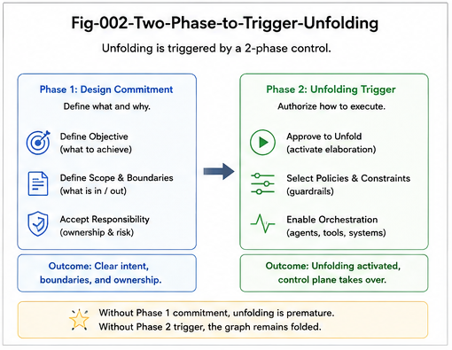

# CGU-002 — From Two-Phase Search to Trigger-Localized Unfolding

## A Structural Lineage from Explicit Universe Localization to Folded Functional Expansion

**Project:** CallingGraph Unfolding for AI Coding
**Series:** CGU — CallingGraph Unfolding
**Document:** CGU-002
**Status:** Foundational Theory
**Scope:** Function-Only CallingGraph
**Version:** v1.0

---

## Abstract

CallingGraph Unfolding does not emerge in isolation.

Its structural logic can be understood as part of a broader computational progression:

$$
\text{Full-Universe Search}
\rightarrow
\text{Two-Phase Search}
\rightarrow
\text{Structural Localization}
\rightarrow
\text{Trigger-Localized Unfolding}
$$

The earliest form searches directly over a large universe.

Two-Phase Search improves this process by first identifying a candidate region and then performing a more focused second-stage search.

CallingGraph Unfolding advances this structural pattern further. Rather than repeatedly localizing from a largely explicit universe, much of the relevant search structure has already been folded into the CallingGraph. A trigger can therefore activate a structural hotspot and unfold a bounded functional region.

This paper argues that Two-Phase Search should be understood as an explicit structural predecessor to CallingGraph Unfolding.

The central distinction is:

$$
\boxed{
\text{Explicit Universe Localization}
\rightarrow
\text{Pre-Folded Structural Localization}
}
$$

This transition changes the computational role of structure. Structure is no longer only something discovered during search; it becomes reusable infrastructure that can guide future search, reasoning, planning, and AI coding.

The paper remains deliberately limited to the Function dimension of CallingGraphs.

---



---

# 1. Introduction

Many computational systems begin from the same basic problem:

> A large universe contains a relatively small region relevant to the current task.

The simplest solution is to search the entire universe.

Formally:

$$
\mathcal{U} = \{x_1,x_2,\dots,x_n\}
$$

and the system seeks:

$$
x^*
\in
\mathcal{U}
$$

using some search function:

$$
S(\mathcal{U})
\rightarrow
x^*
$$

This model is general.

But it is often inefficient.

As systems become larger, more complex, or more structurally organized, a different principle becomes valuable:

> **Do not search all possibilities equally. First locate the relevant region.**

This principle leads naturally to Two-Phase Search.

CallingGraph Unfolding continues this evolution.

---

# 2. Full-Universe Search

The most direct search model is:

```text id="en2g3p"
Universe
   |
   v
Search Everything
   |
   v
Evaluate Candidates
   |
   v
Target
```

Mathematically:

$$
S:
\mathcal{U}
\rightarrow
x^*
$$

The entire universe remains operationally visible to the search process.

The cost therefore tends to depend strongly on:

$$
|\mathcal{U}|
$$

In simplified form:

$$
Cost_{full}
\propto
|\mathcal{U}|
$$

This does not mean every implementation literally touches every element.

Indexing, heuristics, caching, and pruning may improve efficiency.

However, the conceptual model still treats the universe as the primary search domain.

---

# 3. The Structural Weakness of Full-Universe Search

Full-Universe Search underuses one important asset:

$$
\boxed{
Prior\ Structure
}
$$

Suppose the universe is already organized.

For example:

```text id="hnguu0"
Universe
|
+-- Region A
|   +-- A1
|   +-- A2
|
+-- Region B
|   +-- B1
|   +-- B2
|
+-- Region C
    +-- C1
    +-- C2
```

If the target almost certainly lies in Region B, searching Regions A and C at equal priority wastes structure.

Thus the central question becomes:

> Can the system first identify the relevant region and only then perform detailed search?

This leads to Two-Phase Search.

---

# 4. Two-Phase Search

The canonical form is:

$$
\boxed{
Universe
\rightarrow
Candidate\ Space
\rightarrow
Target
}
$$

More explicitly:

$$
Phase\ I:
\mathcal{U}
\rightarrow
\mathcal{C}
$$

followed by:

$$
Phase\ II:
\mathcal{C}
\rightarrow
x^*
$$

where:

$$
\mathcal{C}
\subset
\mathcal{U}
$$

The first phase performs coarse localization.

The second phase performs focused refinement.

The process can be represented as:

```text id="jm2uu3"
Large Universe
     |
     | Phase I
     v
Candidate Region
     |
     | Phase II
     v
Target
```

The key gain is structural reduction:

$$
|\mathcal{C}|
\ll
|\mathcal{U}|
$$

when localization is effective.

---

# 5. Two-Phase Search as Structural Localization

The deeper meaning of Two-Phase Search is not simply “search twice.”

Its essential operation is:

$$
\boxed{
Localization
}
$$

Phase I answers:

> Where should computation focus?

Phase II answers:

> What is the best result inside that region?

Thus Two-Phase Search can be rewritten as:

$$
\text{Universe}
\rightarrow
\text{Localization}
\rightarrow
\text{Focused Computation}
$$

This formulation is important because it reveals a reusable structural pattern.

The pattern is not tied to one algorithm.

It appears whenever a system first narrows a large domain and then computes locally.

---

# 6. Explicit Universe Localization

Two-Phase Search usually assumes that the larger universe remains explicit or externally available.

That is:

$$
\mathcal{U}
$$

exists as the background domain.

The first phase must repeatedly compute:

$$
L(\mathcal{U},q)
\rightarrow
\mathcal{C}
$$

for query, task, or trigger \(q\).

Therefore the localization itself depends on interaction with the larger universe.

We call this:

> **Explicit Universe Localization**

The computational sequence is:

```text id="uxib27"
Universe
   |
   v
Localization
   |
   v
Candidate Region
   |
   v
Local Search
```

This model is already structurally superior to undifferentiated global search.

But it can be improved further when useful structure is persistent.

---

# 7. From Repeated Localization to Folded Structure

Suppose similar localization patterns recur.

A system repeatedly discovers that:

```text id="swm3j0"
Task Type A -> Region A
Task Type B -> Region B
Task Type C -> Region C
```

If these relationships are stable enough, it may be wasteful to rediscover them from scratch each time.

Instead, the system can preserve them structurally.

Conceptually:

$$
Repeated\ Search\ Experience
\rightarrow
Structural\ Folding
$$

The result is a reusable representation:

$$
\mathcal{F}
$$

containing previously discovered structural organization.

Now future localization can use:

$$
L(\mathcal{F},q)
$$

instead of repeatedly rebuilding locality from the full universe.

This is an important evolutionary step.

---

# 8. CallingGraph as Pre-Folded Localization Structure

A CallingGraph already contains substantial functional organization.

For example:

```text id="9hrv39"
Request
   |
   v
Authentication
   |
   v
Validation
   |
   v
Service
   |
   v
Repository
```

The CallingGraph has already folded source-code detail into structural relations.

Therefore a task such as:

```text id="p3lfph"
"Inspect repository persistence behavior"
```

does not need to rediscover all relevant source-code relations from zero.

The graph already provides:

$$
Repository
\leftarrow
Service
\leftarrow
Validation
$$

and potentially:

$$
Repository
\rightarrow
Database
$$

Thus:

$$
Program\ Universe
\xrightarrow{Folding}
CallingGraph
$$

creates reusable localization infrastructure.

---

# 9. Trigger-Localized Unfolding

CallingGraph Unfolding begins when a trigger activates a relevant region of the folded structure.

The general sequence is:

$$
CG
\xrightarrow{Trigger}
CG_{local}
\xrightarrow{Unfolding}
\mathcal{U}_{local}
$$

or:

$$
\boxed{
Folded\ Structure
+
Trigger
\rightarrow
Localized\ Unfolding
}
$$

This differs from ordinary Two-Phase Search in an important way.

Two-Phase Search:

$$
Universe
\rightarrow
Candidate\ Region
\rightarrow
Target
$$

CallingGraph Unfolding:

$$
Folded\ Structure
\rightarrow
Activated\ Region
\rightarrow
Functional\ Expansion
$$

The relevant search space has already been structurally compressed.

---

# 10. The Main Evolutionary Transition

The central transition of this paper is:

$$
\boxed{
Explicit\ Universe\ Localization
\rightarrow
Pre\text{-}Folded\ Structural\ Localization
}
$$

In Two-Phase Search:

$$
L(\mathcal{U},q)
\rightarrow
\mathcal{C}
$$

The universe remains an explicit localization substrate.

In CallingGraph Unfolding:

$$
L(CG,t)
\rightarrow
CG_{local}
$$

The CallingGraph already embodies useful structural organization.

Thus the computational burden shifts.

Instead of repeatedly asking:

> Which part of the universe matters?

the system increasingly asks:

> Which part of the already-folded structure should be activated?

That is a different computational regime.

---

# 11. Search Before Folding

The earlier model can be summarized as:

```text id="3c0505"
Universe
   |
   v
Search
   |
   v
Localization
   |
   v
Candidate
   |
   v
Computation
```

The structure emerges during the search process.

---

# 12. Search After Folding

The CGU model becomes:

```text id="fvx2k0"
Universe
   |
   | Folding
   v
CallingGraph
   |
   | Trigger
   v
Structural Hotspot
   |
   | Unfolding
   v
Localized Computation
```

Here structure exists before the new task arrives.

This makes it reusable.

The distinction is:

$$
\boxed{
Discover\ Structure\ During\ Search
\quad vs \quad
Reuse\ Structure\ Before\ Search
}
$$

---

# 13. Why Folding Changes Search

Folding changes the role of historical computation.

Without folding:

$$
Search_t
$$

often begins largely from the explicit universe again.

With folding:

$$
Search_{t+1}
$$

can exploit structural knowledge accumulated earlier.

Conceptually:

$$
Past\ Computation
\rightarrow
Folded\ Structure
\rightarrow
Future\ Localization
$$

This creates a form of structural memory.

The CallingGraph is therefore not merely a representation of past software organization.

It can become infrastructure for future computation.

---

# 14. Structural Hotspots

A trigger need not activate the entire CallingGraph.

Instead, it identifies a **structural hotspot**.

Suppose:

```text id="ohnx6u"
                    Checkout
                       |
          +------------+------------+
          |                         |
          v                         v
      Inventory                   Payment
          |                         |
          v                 +-------+-------+
       Reserve              |               |
                            v               v
                       Authorization      Refund
```

A refund-related task can localize:

```text id="vwj2sz"
Payment
   |
   v
Refund
```

rather than unfold the entire graph.

Thus:

$$
t_{refund}
\rightarrow
CG_{refund}
$$

and:

$$
U(CG,t_{refund}) = \mathcal{U}_{refund}
$$

This localized region is a structural hotspot.

---

# 15. Hotspot Unfolding vs Global Expansion

A naive graph expansion model might perform:

$$
Expand(CG)
\rightarrow
All\ Reachable\ Paths
$$

This can become expensive or meaningless.

Hotspot Unfolding instead uses:

$$
U(CG,t,b)
$$

where:

* \(t\) is the trigger;
* \(b\) is a structural bound.

Possible bounds include:

* depth;
* node count;
* direction;
* target function;
* branch count;
* task boundary.

Therefore:

$$
\boxed{
Unfolding = Localized
+
Bounded
}
$$

This is essential for scalable use.

---

# 16. Two-Phase Search as a Predecessor, Not an Equivalent

It is important not to collapse Two-Phase Search and CallingGraph Unfolding into the same algorithm.

They share a structural principle:

$$
Localization
\rightarrow
Focused\ Computation
$$

But they differ in where the structure comes from.

Two-Phase Search usually constructs locality from the explicit universe.

CallingGraph Unfolding operates on locality encoded in a pre-existing folded structure.

Thus:

$$
Two\text{-}Phase\ Search
\neq
CallingGraph\ Unfolding
$$

but:

$$
\boxed{
Two\text{-}Phase\ Search
\text{ is a structural predecessor of CG Unfolding.}
}
$$

---

# 17. A Three-Stage Evolution

The progression can be summarized as three stages.

### Stage I — Full-Universe Search

$$
\mathcal{U}
\rightarrow
Target
$$

Main characteristic:

> Search is dominated by the global universe.

---

### Stage II — Two-Phase Localization

$$
\mathcal{U}
\rightarrow
\mathcal{C}
\rightarrow
Target
$$

Main characteristic:

> Localization reduces the active search space.

---

### Stage III — Trigger-Localized Unfolding

$$
Folded\ Structure
\rightarrow
Localized\ Structure
\rightarrow
Functional\ Expansion
$$

Main characteristic:

> Reusable structure localizes computation before detailed expansion.

---

# 18. From Search Space to Structural Space

The transition can also be expressed as:

$$
Search\ Space
\rightarrow
Candidate\ Space
\rightarrow
Structural\ Space
$$

Traditional search emphasizes the set of things that can be inspected.

CallingGraph Unfolding emphasizes the organization of functional relations.

This is a shift from:

$$
\boxed{
Where\ are\ the\ candidates?
}
$$

toward:

$$
\boxed{
What\ structural\ region\ should\ become\ active?
}
$$

That distinction matters greatly for AI coding.

---

# 19. Why This Matters for AI Coding

AI coding systems frequently face large software repositories.

A local request may involve only a small part of the repository.

Without structural localization:

$$
Task
\rightarrow
Large\ Context
\rightarrow
LLM
$$

With CallingGraph-based localization:

$$
Task
\rightarrow
CG\ Hotspot
\rightarrow
Localized\ Context
\rightarrow
AI\ Coding
$$

Thus:

$$
\boxed{
CallingGraph
\rightarrow
Context\ Localization
}
$$

This can reduce irrelevant context and improve structural focus.

The important point is not merely token reduction.

It is:

> **The context is selected according to functional topology.**

---

# 20. From Context Retrieval to Structural Activation

Typical retrieval asks:

> Which files, chunks, or documents are relevant?

CallingGraph Unfolding asks:

> Which functional structures are relevant?

Thus the unit of localization changes.

From:

$$
Text\ Chunk
$$

to:

$$
Functional\ Region
$$

This distinction can produce better task decomposition.

For example:

```text id="3igobe"
Feature Request
      |
      v
CallingGraph Hotspot
      |
      +--> API Region
      |
      +--> Business Logic Region
      |
      +--> Persistence Region
```

This structure can later guide specialized AI agents.

---

# 21. Structural Localization Before Agent Dispatch

CallingGraph Unfolding also prepares the foundation for distributed AI coding.

The ordering should be:

$$
Task
\rightarrow
Localization
\rightarrow
Structural\ Segmentation
\rightarrow
Agent\ Dispatch
$$

rather than:

$$
Task
\rightarrow
Agents
\rightarrow
Hope\ for\ Coordination
$$

This produces the principle:

$$
\boxed{
Structure
\rightarrow
Organization
\rightarrow
Agents
}
$$

The Design-Time CallingGraph framework developed in CGU-003 builds directly on this principle.

---

# 22. LLM Unfolding and CallingGraph Unfolding

A conceptual comparison is again useful.

An LLM receives:

$$
Prompt
$$

and produces:

$$
Localized\ Token\ Generation
$$

A CallingGraph receives:

$$
Trigger
$$

and produces:

$$
Localized\ Functional\ Expansion
$$

The shared pattern is:

$$
Folded\ Representation
+
Trigger
\rightarrow
Localized\ Output
$$

The representations are different.

But both suggest that large computational systems can benefit from storing structure in folded form and exposing only relevant regions when triggered.

---

# 23. The Main Difference from Two-Phase Search

We can now state the distinction precisely.

Two-Phase Search:

$$
\boxed{
Universe
\rightarrow
Localization
\rightarrow
Focused\ Search
}
$$

CG Unfolding:

$$
\boxed{
Folded\ Structure
\rightarrow
Activation
\rightarrow
Localized\ Expansion
}
$$

Therefore the major transformation is:

$$
\boxed{
Search\ then\ Structure
\quad\Longrightarrow\quad
Structure\ then\ Search/Unfold
}
$$

This is one of the central claims of the CGU framework.

---

# 24. Structural Reuse

Once a CallingGraph is available, many future tasks can reuse the same folded structure.

For triggers:

$$
t_1,t_2,\dots,t_n
$$

the system can produce:

$$
U(CG,t_1)
$$

$$
U(CG,t_2)
$$

$$
\vdots
$$

$$
U(CG,t_n)
$$

without reconstructing the entire functional topology each time.

Thus:

$$
\boxed{
One\ Folded\ Structure
\rightarrow
Many\ Localized\ Unfoldings
}
$$

This reuse gives Folding long-term computational value.

---

# 25. Structural Memory

The same idea can be interpreted as structural memory.

The CallingGraph preserves information about functional organization across tasks.

Therefore:

$$
CG = Persistent\ Structural\ Memory
$$

in a limited but useful sense.

The graph remembers:

* which functions exist;
* how they connect;
* which paths are reachable;
* where functional neighborhoods lie;
* how local regions relate to larger structures.

A future trigger can reactivate these relationships.

This means:

$$
Memory
+
Trigger
\rightarrow
Localized\ Structure
$$

which is closely related to Unfolding.

---

# 26. From Static Graph Traversal to Computational Unfolding

One might ask:

> Is CallingGraph Unfolding just graph traversal?

The answer is:

> Graph traversal is likely to be one implementation primitive, but Unfolding is a broader computational role.

A traversal algorithm answers:

$$
Which\ nodes\ are\ reachable?
$$

Unfolding may additionally involve:

* identifying the relevant starting region;
* selecting a traversal direction;
* bounding expansion;
* ranking alternative paths;
* producing structural explanations;
* generating coding tasks;
* comparing expected and realized structures.

Thus:

$$
Traversal
\subseteq
Unfolding\ Mechanism
$$

but:

$$
Unfolding
\neq
Traversal\ Alone
$$

This distinction will matter for future CGU implementations.

---

# 27. Candidate-First vs Structure-First Computation

Two-Phase Search is often candidate-first:

$$
Universe
\rightarrow
Candidates
\rightarrow
Target
$$

CallingGraph Unfolding is structure-first:

$$
CallingGraph
\rightarrow
Structural\ Hotspot
\rightarrow
Functional\ Possibilities
$$

This suggests two computational philosophies.

### Candidate-First

Find promising objects.

### Structure-First

Find the promising structural region, then expose the relevant objects and relations.

For software systems, the second may often be more natural because functional meaning is relational.

---

# 28. Why Calling Paths Matter

CallingGraph Unfolding is especially powerful because functional behavior often appears as paths rather than isolated nodes.

A task rarely concerns one function alone.

Instead:

$$
A
\rightarrow
B
\rightarrow
C
$$

may represent one functional route.

Thus the important unit is often:

$$
Calling\ Path
$$

rather than:

$$
Function
$$

A trigger can therefore localize:

$$
P_{local}
\subseteq
\mathcal{P}(CG)
$$

where:

$$
\mathcal{P}(CG)
$$

is the path space of the CallingGraph.

This makes Unfolding inherently trajectory-like even within the Function-only model.

---

# 29. Unfolding Depth

A practical CGU engine needs a concept of depth.

For a trigger centered on node \(v\):

$$
U_d(CG,v)
$$

can represent the unfolded region within depth \(d\).

For example:

$$
d=1
$$

returns immediate callers or callees.

$$
d=2
$$

returns one additional functional layer.

This creates controllable locality:

$$
U_1
\subseteq
U_2
\subseteq
\dots
\subseteq
U_n
$$

until some structural bound is reached.

---

# 30. Directional Unfolding

CallingGraph Unfolding can also be directional.

### Downstream Unfolding

$$
U_{\downarrow}(CG,v)
$$

asks:

> What can this function call?

---

### Upstream Unfolding

$$
U_{\uparrow}(CG,v)
$$

asks:

> What can call this function?

---

### Bidirectional Unfolding

$$
U_{\leftrightarrow}(CG,v)
$$

asks:

> What is the local functional neighborhood around this function?

These simple operators provide a practical starting point for future CGU demos.

---

# 31. Target-Bounded Unfolding

Another useful form is:

$$
U(CG,v_s,v_t)
$$

where:

* \(v_s\) is a source;
* \(v_t\) is a target.

The system attempts to unfold relevant calling paths connecting them.

This is especially useful for questions such as:

> How can a request reach this database operation?

or:

> Which functional routes connect this controller to this external service?

Such queries are already structurally richer than ordinary text retrieval.

---

# 32. Trigger Types

Within the Function-only scope, possible triggers include:

### Function Trigger

$$
t=v
$$

Example:

```text id="mc1kqj"
"Unfold from PaymentService"
```

### Path Trigger

$$
t=(v_s,v_t)
$$

Example:

```text id="zgbnbd"
"Find functional routes from RequestHandler to Database"
```

### Task Trigger

$$
t=Task
$$

Example:

```text id="2av6qg"
"Implement refund support"
```

### Gap Trigger

$$
t=\Delta
$$

Example:

```text id="oc21hz"
"Investigate missing authorization path"
```

These triggers can all localize different regions of the same folded CallingGraph.

---

# 33. The Reusability Advantage

Suppose a repository receives hundreds of AI coding tasks.

Without persistent structural folding:

$$
Task_i
\rightarrow
Repository\ Search
\rightarrow
Context\ Construction
$$

for every \(i\).

With CallingGraph infrastructure:

$$
Repository
\xrightarrow{Folding}
CG
$$

once, then repeatedly:

$$
Task_i
\rightarrow
U(CG,t_i)
$$

This creates:

$$
\boxed{
Amortized\ Structural\ Localization
}
$$

The cost of constructing structure can be reused across many future tasks.

This may become an important engineering advantage of CG-based AI coding systems.

---

# 34. From Localization to Planning

Once the relevant region is unfolded, the result can support more than search.

For example:

```text id="tm12vd"
Task
   |
   v
CG Localization
   |
   v
Unfolded Functional Region
   |
   +--> Existing Functions
   |
   +--> Missing Functions
   |
   +--> Required Paths
   |
   +--> Candidate Modification Points
```

This can then become a design object.

Therefore:

$$
Localization
\rightarrow
Unfolding
\rightarrow
Planning
$$

The next paper develops this transition through the Design-Time CallingGraph.

---

# 35. From Planning to Structural Wargaming

If multiple functional designs are possible:

$$
CG_A
$$

$$
CG_B
$$

$$
CG_C
$$

they can be unfolded before implementation.

For each:

$$
U(CG_i,T)
$$

can reveal different functional consequences.

This supports:

$$
\boxed{
Structural\ Wargaming
}
$$

before code is generated.

Thus the lineage continues:

$$
Search
\rightarrow
Localization
\rightarrow
Unfolding
\rightarrow
Simulation
\rightarrow
Planning
$$

This is a major extension of the original search idea.

---

# 36. A Canonical Evolution Diagram

The full structural progression can be written as:

```text id="t6kuf5"
FULL-UNIVERSE SEARCH
        |
        v
Search Large Space
        |
        v
      Target


TWO-PHASE SEARCH
        |
        v
     Universe
        |
     Phase I
        v
 Candidate Space
        |
     Phase II
        v
      Target


CALLINGGRAPH UNFOLDING
        |
        v
Folded Functional Structure
        |
      Trigger
        v
 Structural Hotspot
        |
    Localization
        v
 Localized Unfolding
        |
        v
 Reason / Plan / Code
```

The final stage does not eliminate search.

It reorganizes where search occurs.

---

# 37. Computational Interpretation

A simplified computational comparison is:

### Full Search

$$
Cost_{full}
\approx
f(|\mathcal{U}|)
$$

### Two-Phase Search

$$
Cost_{2p}
\approx
Cost(Localize(\mathcal{U}))
+
f(|\mathcal{C}|)
$$

### CG Unfolding

$$
Cost_{CGU}
\approx
Cost(Activate(CG,t))
+
f(|\mathcal{U}_{local}|)
$$

The exact complexity depends on representation and implementation.

The important hypothesis is:

$$
|\mathcal{U}_{local}|
\ll
|\mathcal{U}|
$$

for well-localized tasks.

This remains an empirical research question.

---

# 38. A Structural Learning Interpretation

There is another deeper interpretation.

Two-Phase Search can repeatedly discover useful candidate regions.

Those recurring localization patterns can eventually be folded.

Thus:

$$
Search
\rightarrow
Repeated\ Localization
\rightarrow
Stable\ Structure
\rightarrow
Folding
$$

Once folded:

$$
Folding
\rightarrow
Future\ Unfolding
$$

This gives a developmental cycle:

$$
\boxed{
Search
\rightarrow
Discover\ Structure
\rightarrow
Fold
\rightarrow
Reuse
\rightarrow
Unfold
}
$$

This connects CGU to broader questions of structural learning.

---

# 39. CallingGraph as a Reusable Search Prior

A CallingGraph can also be interpreted as a structural prior.

Before a new task arrives, the graph already says:

> These functions are related.

> These paths exist.

> These regions are near each other.

> These functional routes are reachable.

Therefore:

$$
CG
\rightarrow
Prior\ Structural\ Constraint
$$

The trigger then narrows this prior:

$$
(CG,t)
\rightarrow
Localized\ Prior
$$

This can guide both reasoning and code generation.

---

# 40. Why This Is More Than Optimization

One could interpret CGU merely as a speed optimization.

That would be too narrow.

The deeper contribution is not simply:

$$
Less\ Search
$$

but:

$$
\boxed{
Better\ Structural\ Organization\ of\ Computation
}
$$

The structure can support:

* localization;
* explanation;
* decomposition;
* planning;
* dispatch;
* comparison;
* certification.

Thus Folding and Unfolding reorganize the computational architecture, not only its runtime cost.

---

# 41. Boundaries of the Current Model

This paper deliberately avoids several richer forms.

It does not yet model:

$$
Condition
$$

$$
Runtime\ State
$$

$$
Policy
$$

$$
Probability
$$

$$
Temporal\ Structure
$$

The current object remains:

$$
CG_F=(V_F,E_F)
$$

This limitation is intentional.

The purpose is to establish the structural transition:

$$
\boxed{
Universe\ Search
\rightarrow
Structural\ Localization
\rightarrow
Function\text{-}Only\ CG\ Unfolding
}
$$

before introducing additional dimensions.

---

# 42. Research Questions

### RQ-1 — When does Two-Phase Search outperform direct full search?

This depends on:

* universe size;
* localization accuracy;
* candidate-region size;
* repeated-query frequency.

---

### RQ-2 — When is Folding worth maintaining?

A persistent CallingGraph has construction and maintenance costs.

Therefore the benefit depends on:

$$
Reuse\ Frequency
$$

and:

$$
Structural\ Stability
$$

---

### RQ-3 — How accurately can a trigger locate a functional hotspot?

Localization quality is central to CGU.

A poor hotspot may create:

$$
Too\ Wide
$$

or:

$$
Too\ Narrow
$$

an Unfolding region.

---

### RQ-4 — What is the correct Unfolding bound?

This requires balancing:

$$
Coverage
$$

against:

$$
Computational\ Cost
$$

and:

$$
Structural\ Noise
$$

---

### RQ-5 — Can CGU improve AI coding accuracy?

The central empirical question is whether:

$$
Task
\rightarrow
CGU
\rightarrow
Localized\ Coding
$$

outperforms:

$$
Task
\rightarrow
Unstructured\ Repository\ Context
\rightarrow
Coding
$$

---

### RQ-6 — Can structural hotspots become reusable coding units?

If yes, CallingGraph regions may become persistent AI coding modules or dispatch units.

---

# 43. Canonical Statements

### Canonical Statement I

> **Two-Phase Search is a structural predecessor of CallingGraph Unfolding because both separate localization from detailed computation.**

### Canonical Statement II

> **The critical transition is from explicit universe localization to localization over a pre-folded structural representation.**

### Canonical Statement III

> **CallingGraph Unfolding reuses persistent functional structure so that future computation can begin from a structural hotspot rather than from the full program universe.**

### Canonical Statement IV

> **The purpose of Folding is not only compression; it is to preserve reusable structure for future localized computation.**

---

# 44. The Structural Lineage

The central lineage of this paper is:

$$
\boxed{
Full\ Universe
\rightarrow
Candidate\ Space
\rightarrow
Structural\ Hotspot
\rightarrow
Localized\ Unfolding
}
$$

Or more conceptually:

$$
\boxed{
Global\ Search
\rightarrow
Localization
\rightarrow
Structural\ Memory
\rightarrow
Structural\ Reactivation
}
$$

CallingGraph Unfolding is therefore not an isolated graph technique.

It is part of a broader evolution in how computational systems organize large possibility spaces.

---

# 45. Conclusion

Two-Phase Search provides a crucial conceptual bridge between ordinary search and CallingGraph Unfolding.

The full-universe model begins with:

$$
\mathcal{U}
\rightarrow
Target
$$

Two-Phase Search introduces:

$$
\mathcal{U}
\rightarrow
\mathcal{C}
\rightarrow
Target
$$

and therefore establishes the principle:

$$
\boxed{
Localize\ First
}
$$

CallingGraph Unfolding advances this principle by introducing persistent folded structure:

$$
Program
\xrightarrow{Folding}
CG
$$

followed by:

$$
CG
\xrightarrow{Trigger}
CG_{local}
\xrightarrow{Unfolding}
\mathcal{U}_{local}
$$

The key transition is:

$$
\boxed{
Explicit\ Universe\ Localization
\rightarrow
Pre\text{-}Folded\ Structural\ Localization
}
$$

This changes the role of structure from a temporary search result into reusable computational infrastructure.

The CallingGraph can therefore become:

* a structural memory;
* a localization engine;
* an Unfolding substrate;
* a planning object;
* an AI coding context selector;
* a future dispatch structure;
* and eventually a validation and certification reference.

This progression prepares the next major step:

$$
\boxed{
CallingGraph
\rightarrow
Design\text{-}Time\ CallingGraph
}
$$

where functional structure is no longer only extracted from existing code, but deliberately constructed before code exists.

That transition is the subject of CGU-003.

---

## Next in the CGU Series

**CGU-003 — Design-Time CallingGraph: Structural Wargaming for AI/ASI Coding**

The next paper introduces the Design-Time CallingGraph as a pre-coding structural object for:

* architecture planning;
* primary and alternative functional plans;
* structural simulation;
* localized AI coding;
* task segmentation;
* specialist agent dispatch;
* and later differential validation.

Its central principle is:

$$
\boxed{
Structure
\rightarrow
Organization
\rightarrow
Agents
}
$$

rather than:

$$
Agents
\rightarrow
Organization
$$

---

## Scope Note

CGU-002 remains strictly within the **Function-only CallingGraph model**.

Future extensions may explore:

$$
F+C
$$

$$
F+C+S
$$

and policy/projection operators.

These richer dimensions are intentionally deferred until the Function-only Unfolding model is sufficiently understood and experimentally validated.

---

**CGU-002 Principle**

$$
\boxed{
\text{Search Less of the Universe. Reuse More of the Structure.}
}
$$
