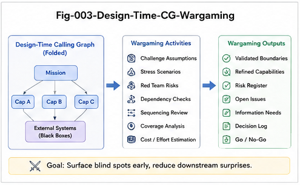

# CGU-003 — Design-Time CallingGraph

## Structural Wargaming for AI/ASI Coding

**Project:** CallingGraph Unfolding for AI Coding
**Series:** CGU — CallingGraph Unfolding
**Document:** CGU-003
**Status:** Core Architecture Paper
**Scope:** Function-Only CallingGraph
**Version:** v1.0

---

## Abstract

CallingGraphs are traditionally extracted from software after implementation.

This paper proposes a fundamental reversal:

> **A CallingGraph can be designed before the program exists.**

We call this structure a **Design-Time CallingGraph (DT-CG)**.

A Design-Time CallingGraph represents the intended functional topology of future software. Instead of serving only as a post-hoc description of existing code, it becomes a pre-coding structural object for architecture planning, functional decomposition, structural simulation, alternative-plan comparison, AI-agent dispatch, and later validation.

The resulting AI coding paradigm changes from:

$$
Requirement
\rightarrow
Prompt
\rightarrow
Code
$$

to:

$$
Requirement
\rightarrow
DT\text{-}CG
\rightarrow
Unfolding
\rightarrow
Structural\ Wargaming
\rightarrow
Task\ Segmentation
\rightarrow
AI\ Coding
$$

A DT-CG can support a primary plan, alternative plans, fallback structures, and localized coding units before source code is generated. Once implementation is complete, the realized program can be folded back into a Runtime or Realized CallingGraph (RT-CG), creating a structural comparison loop:

$$
DT\text{-}CG
\rightarrow
Code
\rightarrow
RT\text{-}CG
$$

This paper develops the Function-only foundation of this model and introduces the central principle:

$$
\boxed{
Structure
\rightarrow
Organization
\rightarrow
Agents
}
$$

rather than:

$$
Agents
\rightarrow
Organization
$$

The Design-Time CallingGraph therefore represents a possible structural control plane for future AI/ASI software engineering.

---



---

# 1. Introduction

Most CallingGraph systems begin after code exists.

The conventional direction is:

$$
Program
\rightarrow
CallingGraph
$$

The graph is extracted from implementation and used for:

* analysis;
* debugging;
* visualization;
* dependency inspection;
* security review;
* optimization;
* testing;
* certification.

This is valuable.

But CallingGraph Unfolding introduces another possibility.

If a CallingGraph can be unfolded into useful functional possibilities, then it does not need to originate only from existing code.

It can also originate from:

$$
Intent
$$

$$
Requirements
$$

$$
Architecture
$$

$$
Functional\ Design
$$

Therefore:

$$
Intent
\rightarrow
CallingGraph
$$

can exist before:

$$
CallingGraph
\rightarrow
Code
$$

This creates the concept of the:

$$
\boxed{
Design\text{-}Time\ CallingGraph
}
$$

or:

$$
\boxed{
DT\text{-}CG
}
$$

---

# 2. Definition of the Design-Time CallingGraph

A **Design-Time CallingGraph** is:

> **A pre-implementation functional calling structure that represents how a future software system is intended to organize and connect its callable units.**

In the Function-only model:

$$
DT\text{-}CG=(V_D,E_D)
$$

where:

* \(V_D\) contains planned functional units;
* \(E_D\) contains intended calling relations.

The DT-CG describes:

> **What the software should structurally become.**

This differs from a graph extracted from implemented software, which describes:

> **What the software actually became.**

---

# 3. Design-Time CG vs Runtime / Realized CG

We therefore distinguish two structural objects.

## 3.1 Design-Time CallingGraph

$$
DT\text{-}CG
$$

represents intended functional structure.

---

## 3.2 Runtime / Realized CallingGraph

$$
RT\text{-}CG
$$

represents the functional structure realized by implementation.

The relationship is:

$$
\boxed{
DT\text{-}CG
\rightarrow
AI\ Coding
\rightarrow
RT\text{-}CG
}
$$

This simple distinction creates a structural basis for both planning and validation.

---

# 4. From Code-First to Structure-First AI Coding

Many AI coding workflows approximately follow:

```text id="f6bxcg"
Requirement
    |
    v
Prompt
    |
    v
LLM / Coding Agent
    |
    v
Code
    |
    v
Test
```

The structure of the program is discovered during generation.

The DT-CG model reverses the order:

```text id="7yei2g"
Requirement
    |
    v
Functional Design
    |
    v
Design-Time CallingGraph
    |
    v
Structural Unfolding
    |
    v
Localized Coding Tasks
    |
    v
AI Coding
```

Thus:

$$
\boxed{
Structure\ Before\ Tokens
}
$$

becomes a central architectural principle.

---

# 5. DT-CG as a Generative Structural Skeleton

A Design-Time CallingGraph is not source code.

It does not specify every statement.

Instead:

$$
DT\text{-}CG
$$

defines structural constraints and possibilities within which code may be generated.

Suppose:

```text id="7sr532"
Request
   |
   v
Authentication
   |
   v
Validation
   |
   v
BusinessService
   |
   v
Persistence
```

Many implementations may satisfy this topology.

Therefore:

$$
DT\text{-}CG
\rightarrow
\mathcal{P}(Program)
$$

where:

$$
\mathcal{P}(Program)
$$

is a set of program implementations compatible with the intended functional structure.

Thus:

> **The DT-CG is a generative structural skeleton, not a deterministic code template.**

---

# 6. Structural Freedom Inside Structural Boundaries

This distinction is important for AI coding.

The DT-CG should not overconstrain generation.

Instead, it provides:

$$
Structural\ Boundary
$$

within which an AI coding system retains implementation freedom.

Conceptually:

```text id="x9mqm0"
       Design-Time CallingGraph
                |
        Structural Boundary
                |
     +----------+----------+
     |          |          |
     v          v          v
Implementation A   B   Implementation C
```

Therefore:

$$
\boxed{
Structural\ Constraint
+
Implementation\ Freedom
}
$$

can coexist.

This is well suited to generative AI.

---

# 7. Design-Time CallingGraph as a Campaign Plan

Complex software development resembles a campaign more than a single isolated task.

There are:

* strategic objectives;
* functional fronts;
* dependencies;
* critical paths;
* fallback routes;
* specialized execution units;
* integration points;
* validation stages.

The DT-CG can therefore be interpreted as:

> **The campaign map of AI coding.**

A requirement may first become:

```text id="vjj3dy"
                     System Objective
                            |
              +-------------+-------------+
              |             |             |
              v             v             v
         API Layer      Core Logic     Persistence
              |             |             |
              +-------------+-------------+
                            |
                            v
                         Runtime
```

This functional map exists before detailed implementation.

---

# 8. Structural Wargaming

Once a DT-CG exists, it can be unfolded before coding begins.

This process is called:

$$
\boxed{
Structural\ Wargaming
}
$$

Structural Wargaming asks:

> If this functional structure is implemented, what paths become possible?

> Which functions become critical?

> Which regions are tightly coupled?

> Which paths are missing?

> Which parts can be independently implemented?

> Which parts create integration risk?

> Which alternate structures may be preferable?

Thus:

$$
DT\text{-}CG
\xrightarrow{Unfolding}
Functional\ Consequences
$$

before source code is committed.

---

# 9. Pre-Coding Structural Simulation

The central operation is:

$$
\boxed{
DT\text{-}CG
\rightarrow
Unfold
\rightarrow
Simulate
\rightarrow
Revise
}
$$

For example:

```text id="g0qah0"
Request
   |
   v
Payment
   |
   v
Persistence
```

may appear sufficient initially.

Unfolding may reveal that additional functional structure is required:

```text id="wvgn9f"
Request
   |
   v
Payment
   |
   +------> Audit
   |
   +------> Retry
   |
   v
Persistence
```

The gap is discovered before implementation.

This is:

> **Design-Time Gap Detection**

rather than post-coding bug detection.

---

# 10. Primary and Alternative DT-CGs

Complex engineering rarely has only one possible design.

Therefore a system may construct:

$$
DT\text{-}CG_A
$$

$$
DT\text{-}CG_B
$$

$$
DT\text{-}CG_C
$$

representing alternative functional plans.

For example:

```text id="2vxy1f"
                     Requirement
                         |
              +----------+----------+
              |          |          |
              v          v          v
          DT-CG A     DT-CG B     DT-CG C
          Primary     Alternative  Fallback
```

Each plan can be unfolded independently.

---

# 11. Differential Design-Time Unfolding

Given a trigger set:

$$
T = \{t_1,t_2,\dots,t_n\}
$$

each candidate design can be tested:

$$
U(DT\text{-}CG_A,T)
$$

$$
U(DT\text{-}CG_B,T)
$$

$$
U(DT\text{-}CG_C,T)
$$

This supports comparative design analysis.

For example:

$$
Coverage_A
$$

$$
Coverage_B
$$

$$
Complexity_A
$$

$$
Complexity_B
$$

$$
CriticalPath_A
$$

$$
CriticalPath_B
$$

can be compared before implementation.

Thus structural design becomes experimentally inspectable.

---

# 12. DT-CG Selection

A Design-Time CallingGraph does not need to be selected only by intuition.

A structural decision process may evaluate:

$$
Score(CG_i) = f(
Coverage,
Complexity,
Modularity,
Risk,
Cost
)
$$

The exact scoring function is outside the current foundational scope.

The important idea is:

$$
\boxed{
Design\ Alternatives
\rightarrow
Structural\ Unfolding
\rightarrow
Comparison
\rightarrow
Selection
}
$$

This turns architecture design into a more explicit computational process.

---

# 13. Structural Wargaming Is Not Runtime Execution

A DT-CG simulation should not be confused with complete runtime simulation.

At the Function-only level, it does not yet model:

* exact data values;
* full program state;
* timing;
* concurrency;
* probability;
* resource behavior.

It asks a narrower question:

> **What functional structures and calling routes become possible or required under this design?**

This limited scope is deliberate.

It allows useful pre-coding reasoning without pretending to predict the full runtime system.

---

# 14. From DT-CG to Coding Units

Once a DT-CG has been selected, it can be segmented.

Suppose:

```text id="fz2fr4"
                     Application
                          |
          +---------------+---------------+
          |               |               |
          v               v               v
      API Layer       Core Service    Persistence
          |               |               |
          v               v               v
      API Units       Logic Units      DB Units
```

The graph naturally defines functional regions.

These regions can become:

$$
Coding\ Units
$$

Thus:

$$
DT\text{-}CG
\rightarrow
Structural\ Segmentation
\rightarrow
Coding\ Units
$$

---

# 15. Structural Segmentation

We define structural segmentation as:

> **The partitioning of a Design-Time CallingGraph into bounded functional subgraphs suitable for independent or semi-independent implementation.**

Let:

$$
DT\text{-}CG=G
$$

A segmentation produces:

$$
G_1,G_2,\dots,G_k
$$

such that:

$$
G_i
\subseteq
G
$$

and collectively:

$$
\bigcup_i G_i
\approx
G
$$

subject to controlled interfaces between segments.

These subgraphs can become AI coding tasks.

---

# 16. Structure Before Agent Assignment

This leads to one of the most important principles of the DT-CG model:

$$
\boxed{
Structure
\rightarrow
Organization
\rightarrow
Agents
}
$$

The opposite approach begins with available agents:

$$
Agents
\rightarrow
Task\ Distribution
$$

This may produce organizational structure that reflects agent availability rather than software structure.

DT-CG reverses that.

First determine:

$$
Functional\ Structure
$$

then:

$$
Task\ Organization
$$

then:

$$
Agent\ Assignment
$$

---

# 17. Structural Dispatch

Suppose a DT-CG unfolds into:

```text id="8cmr57"
                    Feature
                      |
          +-----------+-----------+
          |           |           |
          v           v           v
       API Work    Security    Persistence
```

The system can dispatch:

```text id="sqhsqh"
API Work       -> API Agent
Security       -> Security Agent
Persistence    -> Database Agent
```

Thus:

$$
Subgraph
\rightarrow
Specialized\ Agent
$$

becomes a structural dispatch rule.

---

# 18. CallingGraph as a Dispatch Surface

The CallingGraph can therefore serve as a dispatch surface.

Nodes and subgraphs define:

* implementation ownership;
* specialist requirements;
* coding boundaries;
* integration dependencies.

Conceptually:

$$
DT\text{-}CG
\rightarrow
Dispatch(CG_i,Agent_j)
$$

This is more structured than free-form multi-agent delegation.

---

# 19. Specialized Brain Units

In larger AI/ASI systems, execution units may be specialized.

For example:

```text id="pszkaz"
Security Subgraph
      |
      v
Security Brain Unit

Database Subgraph
      |
      v
Database Brain Unit

Concurrency Subgraph
      |
      v
Concurrency Brain Unit
```

The Design-Time CallingGraph provides the structural basis for deciding when specialized expertise is needed.

Therefore:

$$
\boxed{
Functional\ Topology
\rightarrow
Cognitive\ Specialization
}
$$

may become an important future architecture.

---

# 20. Localized Coding

Each dispatched AI unit should not receive the entire software universe unless necessary.

Instead:

$$
Task_i
\rightarrow
CG_i
\rightarrow
Localized\ Context_i
\rightarrow
AI_i
$$

This creates:

$$
\boxed{
Localized\ AI\ Coding
}
$$

The coding agent operates within a bounded functional region.

This may improve:

* focus;
* context efficiency;
* modularity;
* accountability;
* verification.

---

# 21. Structural Contracts Between Coding Units

Independent coding units still need coordination.

Suppose:

$$
G_A
\rightarrow
G_B
$$

crosses a segmentation boundary.

That edge becomes a structural contract.

For example:

```text id="91j6no"
API Subgraph
    |
    | structural interface
    v
Service Subgraph
```

The implementation teams or AI agents must preserve that intended relation.

Thus segmentation does not destroy global structure.

It converts global structure into local responsibilities plus explicit interfaces.

---

# 22. DT-CG as a Control Plane

At this point, the Design-Time CallingGraph begins to serve multiple roles:

$$
Planning
$$

$$
Simulation
$$

$$
Segmentation
$$

$$
Dispatch
$$

$$
Coordination
$$

$$
Validation\ Reference
$$

This motivates a broader interpretation:

$$
\boxed{
DT\text{-}CG
=
AI\ Coding\ Structural\ Control\ Plane
}
$$

The graph does not necessarily execute code itself.

Instead, it organizes how coding execution occurs.

---

# 23. Control Plane vs Execution Plane

A useful separation is:

### Control Plane

$$
DT\text{-}CG
$$

responsible for:

* structure;
* decomposition;
* dispatch;
* boundaries;
* expected relations.

### Execution Plane

$$
AI\ Coding\ Units
$$

responsible for:

* implementation;
* local reasoning;
* code generation;
* testing;
* repair.

Thus:

```text id="zr2ybe"
        DESIGN / CONTROL PLANE
             DT-CG
               |
      +--------+--------+
      |        |        |
      v        v        v
   Agent A  Agent B  Agent C
      |        |        |
      +--------+--------+
               |
          IMPLEMENTATION
```

This separation may improve both scalability and auditability.

---

# 24. Primary Plan and Fallback Plan

A DT-CG architecture should also support alternative plans.

For example:

$$
CG_{Primary}
$$

and:

$$
CG_{Fallback}
$$

The fallback graph may be activated when implementation of the primary plan becomes unsuitable.

At the Function-only level, this may mean:

* unavailable dependency;
* failed integration;
* excessive complexity;
* missing module;
* unacceptable structural coupling.

The system can then switch structural plans.

---

# 25. Structural Plan Switching

Suppose:

```text id="e9u076"
Primary:
A -> B -> C -> D
```

and:

```text id="mnz4e1"
Fallback:
A -> B -> X -> D
```

If \(C\) becomes infeasible, the control system can activate:

$$
CG_{Fallback}
$$

This makes Design-Time CallingGraphs useful not only for static planning but also for adaptive development.

---

# 26. Structural Replanning

An AI coding campaign may encounter unexpected results.

The system may discover:

$$
Expected\ Path
\neq
Feasible\ Path
$$

Instead of forcing implementation, it can return to the DT-CG:

$$
Execution\ Feedback
\rightarrow
DT\text{-}CG
\rightarrow
Replanning
$$

This produces:

$$
\boxed{
Plan
\rightarrow
Execute
\rightarrow
Observe
\rightarrow
Replan
}
$$

at the structural level.

---

# 27. What Coding Agents Should Return

A coding unit should ideally return more than source code.

A structured result may include:

```text id="f98f9t"
Assigned Subgraph
Implemented Functions
Implemented Calling Relations
Changed Calling Relations
Tests
Unresolved Gaps
Structural Deviations
Confidence
```

This produces:

$$
Code
+
Structural\ Evidence
$$

rather than code alone.

---

# 28. Folding the Result Back

After implementation:

$$
Code_i
\xrightarrow{Folding}
RT\text{-}CG_i
$$

The realized subgraph can then be compared against:

$$
DT\text{-}CG_i
$$

This creates a local validation loop:

$$
DT\text{-}CG_i
\rightarrow
AI_i
\rightarrow
Code_i
\rightarrow
RT\text{-}CG_i
$$

---

# 29. Global Reconstruction

Local implementations can then be merged:

$$
RT\text{-}CG_1
\cup
RT\text{-}CG_2
\cup
\dots
\cup
RT\text{-}CG_k
\rightarrow
RT\text{-}CG
$$

The global realized CallingGraph can be compared with the original design:

$$
DT\text{-}CG
\leftrightarrow
RT\text{-}CG
$$

This is the beginning of structural certification.

---

# 30. Design-to-Realization Delta

Define:

$$
\Delta CG
=
DT\text{-}CG
\ominus
RT\text{-}CG
$$

The delta may contain:

* missing nodes;
* unexpected nodes;
* missing edges;
* unexpected edges;
* missing paths;
* changed functional topology.

This difference is useful, but not sufficient.

Later CGU papers show that similar static graphs may still unfold differently.

---

# 31. Why DT-CG Improves Certification

If a CallingGraph is extracted only after coding, validation lacks a strong structural reference.

But with a DT-CG:

$$
Intent
\rightarrow
DT\text{-}CG
\rightarrow
Implementation
$$

the intended structure is recorded before generation.

This creates provenance.

Therefore:

$$
DT\text{-}CG
$$

becomes a reference artifact for later certification.

This is much stronger than asking after the fact:

> Does this code seem structurally reasonable?

Instead we can ask:

> Did the realized structure preserve the design-time intent?

---

# 32. Structural Provenance

The full chain becomes:

$$
Intent
\rightarrow
DT\text{-}CG
\rightarrow
Unfolding
\rightarrow
Dispatch
\rightarrow
Code
\rightarrow
RT\text{-}CG
$$

This chain records how software moved from intention to realization.

We call this:

$$
\boxed{
Structural\ Provenance
}
$$

The provenance can later support:

* auditing;
* debugging;
* certification;
* learning;
* human review.

---

# 33. Structural Campaign Record

A future AI coding system may maintain a campaign record:

```text id="3rv2ml"
Objective
Design-Time CG
Alternative CGs
Selected Plan
Unfolding Results
Task Segmentation
Agent Assignments
Returned Code
Realized CG
Structural Deltas
Runtime Evidence
Certification Result
```

This converts AI coding from an opaque generation event into an inspectable structural process.

---

# 34. Human Oversight

A DT-CG also creates clearer locations for human intervention.

A human does not need to inspect every generated token.

Instead, review can focus on:

* major functional nodes;
* critical calling paths;
* high-risk boundaries;
* plan changes;
* unresolved structural gaps;
* unexpected RT-CG deviations.

Thus:

$$
Human\ Oversight
\rightarrow
Structural\ Hotspots
$$

rather than:

$$
Human\ Oversight
\rightarrow
Entire\ Codebase
$$

---

# 35. Escalation

A coding agent may return:

$$
Cannot\ Complete
$$

or:

$$
Structural\ Conflict
$$

or:

$$
Unexpected\ Dependency
$$

The control plane can then:

$$
Escalate
$$

to:

* a stronger model;
* a specialized agent;
* a human engineer;
* a redesigned DT-CG.

This makes escalation part of the structural workflow rather than an ad hoc failure response.

---

# 36. DT-CG and Large-Scale AI Coding

The larger the software system becomes, the more useful structural preorganization may become.

A large project may contain:

$$
10^4
$$

or:

$$
10^5
$$

functional units.

A single agent should not necessarily reason over all of them equally.

DT-CG enables:

$$
Large\ System
\rightarrow
Functional\ Regions
\rightarrow
Localized\ Teams
$$

This is analogous to organizational decomposition in large human engineering systems.

---

# 37. AI Coding as a Campaign

The complete model can now be written as:

```text id="hy346s"
OBJECTIVE
   |
   v
DESIGN-TIME CG
   |
   v
STRUCTURAL WARGAMING
   |
   v
PRIMARY / ALTERNATIVE PLANS
   |
   v
STRUCTURAL SEGMENTATION
   |
   v
AI / BRAIN-UNIT DISPATCH
   |
   v
LOCALIZED CODING
   |
   v
RETURNED STRUCTURAL EVIDENCE
   |
   v
REALIZED CG
   |
   v
STRUCTURAL REVIEW
```

This is qualitatively different from one-shot code generation.

---

# 38. DT-CG and Unfolding

The Design-Time CallingGraph becomes useful because it can be unfolded.

Without Unfolding:

$$
DT\text{-}CG
$$

would remain a static blueprint.

With Unfolding:

$$
DT\text{-}CG
\xrightarrow{Trigger}
Functional\ Region
$$

and:

$$
Functional\ Region
\rightarrow
Coding\ Task
$$

Thus:

$$
\boxed{
DT\text{-}CG
+
Unfolding
=
Executable\ Structural\ Planning
}
$$

The term “executable” here means actionable for planning and coding, not necessarily directly machine-executable source code.

---

# 39. Design-Time Triggering

Possible DT-CG triggers include:

### Feature Trigger

```text id="xcslq6"
"Add refund support"
```

### Module Trigger

```text id="bozdrw"
"Implement persistence layer"
```

### Integration Trigger

```text id="1ytg3n"
"Connect authorization to transaction execution"
```

### Gap Trigger

```text id="peiq2o"
"Resolve missing path between validation and persistence"
```

Each trigger activates a local design region.

---

# 40. Local Design Before Local Coding

A useful pattern is:

$$
Task
\rightarrow
Local\ DT\text{-}CG
\rightarrow
Local\ Unfolding
\rightarrow
Local\ Code
$$

This creates a smaller design cycle inside the global campaign.

Therefore DT-CG can exist at multiple granularities:

$$
Global\ DT\text{-}CG
$$

$$
Subsystem\ DT\text{-}CG
$$

$$
Task\ DT\text{-}CG
$$

This supports hierarchical development.

---

# 41. Hierarchical DT-CG

A large DT-CG may contain nested structures.

For example:

```text id="di8myw"
System
 |
 +-- Authentication Subgraph
 |
 +-- Payment Subgraph
 |
 +-- Persistence Subgraph
 |
 +-- Reporting Subgraph
```

Each subgraph can itself be unfolded.

Thus:

$$
CG_{system}
\rightarrow
CG_{subsystem}
\rightarrow
CG_{task}
$$

This hierarchical organization may become important for ASI-scale software engineering.

---

# 42. Structural Modularity

A good Design-Time CallingGraph should expose useful modular boundaries.

Poor design may produce:

$$
Dense\ Cross\ Calling
$$

while better design may create clearer subgraphs.

This suggests future metrics such as:

$$
Coupling(CG)
$$

$$
Modularity(CG)
$$

$$
BoundaryStrength(CG)
$$

These are not developed fully in this paper, but DT-CG makes them actionable before coding.

---

# 43. Design-Time Structural Quality

The quality of a DT-CG may ultimately be evaluated by:

* coverage;
* modularity;
* path simplicity;
* dependency clarity;
* decomposition quality;
* implementation feasibility;
* testability;
* later RT-CG agreement.

Thus software architecture quality may become partially measurable at the CallingGraph level.

---

# 44. Learning from Realized Structures

After many projects:

$$
DT\text{-}CG
\rightarrow
RT\text{-}CG
$$

comparisons may reveal recurring deviations.

Suppose design repeatedly predicts:

$$
A
\rightarrow
B
\rightarrow
C
$$

but implementations repeatedly require:

$$
A
\rightarrow
B
\rightarrow
X
\rightarrow
C
$$

Then \(X\) may represent missing structural knowledge.

This supports:

$$
RT\text{-}CG
\rightarrow
Structural\ Delta
\rightarrow
Candidate\ Design\ Improvement
$$

---

# 45. Structural Learning Loop

The lifecycle becomes:

$$
\boxed{
Design
\rightarrow
Execute
\rightarrow
Observe
\rightarrow
Compare
\rightarrow
Learn
\rightarrow
Better\ Design
}
$$

Thus DT-CGs need not remain static organizational artifacts.

They can improve over time.

---

# 46. From Structural Wargaming to Structural Continual Learning

If design alternatives and runtime outcomes are retained, a system can learn which functional structures work better for particular classes of tasks.

Conceptually:

$$
\{DT\text{-}CG_i,Outcome_i\}
\rightarrow
Structural\ Knowledge
$$

Future planning can then use:

$$
Structural\ Knowledge
\rightarrow
Better\ DT\text{-}CG
$$

This connects Design-Time CallingGraphs to broader structural continual-learning architectures.

---

# 47. Why the Military Analogy Is Useful — and Limited

The “campaign” and “wargaming” analogy is useful because it highlights:

* planning before execution;
* multiple plans;
* specialized units;
* local missions;
* coordination;
* feedback;
* after-action review.

However, DT-CG is a software-engineering construct.

It does not require military semantics.

The same architecture can be described as:

$$
Planning
\rightarrow
Simulation
\rightarrow
Task\ Decomposition
\rightarrow
Distributed\ Execution
\rightarrow
Validation
$$

The analogy is therefore structural rather than domain-specific.

---

# 48. Function-Only Boundary

This first DT-CG model remains strictly Function-only.

It represents:

$$
What\ calls\ what
$$

and:

$$
What\ should\ call\ what
$$

It does not yet formally model:

$$
Condition
$$

$$
State
$$

$$
Policy
$$

$$
Probability
$$

$$
Time
$$

This boundary is important.

The goal is first to determine how far a Function-only Design-Time CallingGraph can support planning and control.

---

# 49. Future Richer DT-CGs

Future extensions may investigate:

$$
DT\text{-}CG_F
$$

then:

$$
DT\text{-}CG_{F+C}
$$

then:

$$
DT\text{-}CG_{F+C+S}
$$

with policy or projection operators.

But these should not be introduced prematurely.

The first research task is:

$$
\boxed{
Can\ Function\text{-}Only\ DT\text{-}CG
substantially\ improve\ AI\ Coding?
}
$$

---

# 50. Research Questions

### RQ-1 — How should requirements be converted into a DT-CG?

This is the fundamental construction problem:

$$
Requirement
\rightarrow
DT\text{-}CG
$$

---

### RQ-2 — What functional granularity should DT-CG nodes use?

Possible levels include:

* function;
* method;
* API;
* service;
* component;
* functional block.

---

### RQ-3 — How should alternative DT-CGs be generated?

Possible mechanisms include:

* human design;
* LLM generation;
* graph transformation;
* retrieval from prior structures;
* evolutionary search.

---

### RQ-4 — How should structural wargaming evaluate DT-CGs?

Potential criteria include:

* path coverage;
* missing functions;
* coupling;
* critical paths;
* implementation complexity.

---

### RQ-5 — How should DT-CGs be segmented?

The segmentation problem must balance:

$$
Independence
$$

against:

$$
Integration\ Cost
$$

---

### RQ-6 — How should subgraphs be matched to AI agents?

This requires a mapping:

$$
CG_i
\rightarrow
Agent_j
$$

based on structural and capability requirements.

---

### RQ-7 — How should agent output be folded back into RT-CG?

The system needs reliable:

$$
Code
\rightarrow
RT\text{-}CG
$$

extraction.

---

### RQ-8 — How should DT-CG and RT-CG differences be interpreted?

Not every difference is a defect.

Some deviations may be:

* implementation refinements;
* justified alternatives;
* discovered requirements;
* structural improvements.

---

### RQ-9 — Can DT-CG improve AI coding reliability?

The core empirical comparison is:

$$
Prompt\rightarrow Code
$$

versus:

$$
Requirement
\rightarrow
DT\text{-}CG
\rightarrow
Localized\ Coding
$$

---

### RQ-10 — Can structural provenance improve certification?

This requires studying whether the chain:

$$
Intent
\rightarrow
DT\text{-}CG
\rightarrow
Code
\rightarrow
RT\text{-}CG
$$

provides stronger certification evidence than post-hoc analysis alone.

---

# 51. Canonical Architecture

The canonical DT-CG architecture is:

```text id="yv2yj4"
                         INTENT
                           |
                           v
                    REQUIREMENTS
                           |
                           v
                 DESIGN-TIME CG
                           |
                 STRUCTURAL UNFOLDING
                           |
                 STRUCTURAL WARGAMING
                           |
             +-------------+-------------+
             |             |             |
             v             v             v
         Primary        Alternate      Fallback
          Plan            Plan           Plan
             \             |             /
              \            |            /
               +-----------+-----------+
                           |
                           v
                STRUCTURAL SEGMENTATION
                           |
             +-------------+-------------+
             |             |             |
             v             v             v
          AI Unit       AI Unit       AI Unit
             |             |             |
             v             v             v
           Code          Code          Code
             \             |             /
              +------------+------------+
                           |
                           v
                        PROGRAM
                           |
                        FOLDING
                           |
                           v
                     REALIZED CG
```

---

# 52. Canonical Statements

### Canonical Statement I

> **A Design-Time CallingGraph describes what future software should structurally become before implementation is complete.**

### Canonical Statement II

> **Design-Time CallingGraphs move AI coding control from token generation toward structural planning.**

### Canonical Statement III

> **Structural wargaming uses CallingGraph Unfolding to inspect and compare functional plans before code is generated.**

### Canonical Statement IV

> **In scalable AI coding, structure should determine task organization, and task organization should determine agent assignment.**

### Canonical Statement V

> **The DT-CG provides a structural reference against which realized software can later be folded, compared, validated, and certified.**

---

# 53. The Paradigm Shift

The conventional paradigm is:

$$
\boxed{
Prompt
\rightarrow
Code
}
$$

A stronger agentic paradigm is:

$$
\boxed{
Task
\rightarrow
Agents
\rightarrow
Code
}
$$

The DT-CG paradigm is:

$$
\boxed{
Intent
\rightarrow
Structure
\rightarrow
Simulation
\rightarrow
Organization
\rightarrow
Agents
\rightarrow
Code
}
$$

The crucial change is not merely the addition of another planning step.

It is the introduction of a persistent, inspectable, machine-operable structural object between intention and generation.

---

# 54. From Software Blueprint to AI Coding Command Structure

Traditional software design documents provide human-readable plans.

DT-CG aims at something stronger:

$$
Human\ Readable
+
Machine\ Operable
$$

The same structure can potentially support:

* design review;
* automated unfolding;
* task generation;
* agent dispatch;
* implementation monitoring;
* structural comparison.

Thus DT-CG can become:

> **a software blueprint that also participates in execution control.**

---

# 55. Conclusion

CallingGraphs need not begin after software implementation.

If CallingGraph Unfolding can expose useful functional possibilities, then CallingGraphs can also be constructed before coding and used as generative structural plans.

This paper introduces the:

$$
\boxed{
Design\text{-}Time\ CallingGraph
}
$$

defined as:

> **a pre-implementation functional calling structure representing what future software should structurally become.**

The core pipeline becomes:

$$
\boxed{
Requirement
\rightarrow
DT\text{-}CG
\rightarrow
Unfolding
\rightarrow
Structural\ Wargaming
\rightarrow
Segmentation
\rightarrow
AI\ Dispatch
\rightarrow
Localized\ Coding
}
$$

After coding:

$$
Code
\rightarrow
RT\text{-}CG
$$

creates a design-to-realization comparison loop.

The central organizational principle is:

$$
\boxed{
Structure
\rightarrow
Organization
\rightarrow
Agents
}
$$

This changes the role of CallingGraphs from post-hoc analysis artifacts into potential control structures for AI/ASI software engineering.

The DT-CG does not remove generative intelligence.

It gives generative intelligence a structural battlefield.

It does not dictate every implementation detail.

It establishes functional boundaries and routes within which intelligent implementation can operate.

It does not replace runtime validation.

It creates a structural reference that makes later validation more meaningful.

The resulting long-term architecture is:

$$
\boxed{
Design
\rightarrow
Unfold
\rightarrow
Simulate
\rightarrow
Dispatch
\rightarrow
Code
\rightarrow
Fold
\rightarrow
Compare
\rightarrow
Learn
}
$$

This is the foundation for the next problem in the CGU series:

> **What happens when the Design-Time and Realized CallingGraphs look similar, but their functional unfoldings differ?**

That question leads directly to the Unfolding Gap.

---

## Next in the CGU Series

**CGU-004 — The Unfolding Gap: Why CallingGraph Match Does Not Guarantee Runtime Equivalence**

The next paper studies the important distinction:

$$
CG_A
\approx
CG_B
$$

does not necessarily imply:

$$
U(CG_A,T)
=
U(CG_B,T)
$$

and introduces:

$$
\boxed{
\Delta_U
}
$$

the **Unfolding Gap**.

This becomes the bridge from Design-Time CallingGraphs to differential validation and confidence-based AI coding certification.

---

## Scope Note

CGU-003 remains strictly within the **Function-only CallingGraph model**.

Condition, State, Policy, Probability, and Temporal dimensions are intentionally deferred.

The first objective is to establish whether a Function-only Design-Time CallingGraph can already provide significant value for:

* structural planning;
* structural simulation;
* coding decomposition;
* agent dispatch;
* design provenance;
* and later validation.

---

**CGU-003 Principle**

$$
\boxed{
\text{Design the Structure Before Generating the Code.}
}
$$
