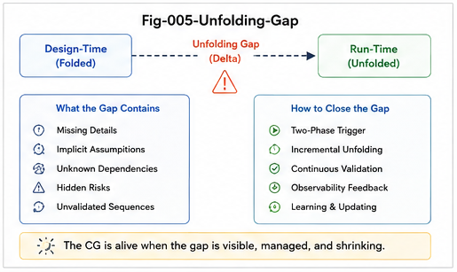

# CGU-004 — The Unfolding Gap

## Why CallingGraph Match Does Not Guarantee Runtime Equivalence

**Project:** CallingGraph Unfolding for AI Coding
**Series:** CGU — CallingGraph Unfolding
**Document:** CGU-004
**Status:** Core Validation Theory
**Scope:** Function-Only CallingGraph
**Version:** v1.0

---

## Abstract

CallingGraph comparison is an important tool for validating software structure.

If two programs produce similar nodes, edges, and calling paths, it is tempting to conclude that they are structurally equivalent and therefore likely to behave equivalently.

This paper argues that such a conclusion is generally too strong.

A CallingGraph is a folded representation. Two folded structures may appear similar while producing different localized functional expansions when activated by a particular trigger.

Therefore:

$$
CG_A
\approx
CG_B
$$

does not necessarily imply:

$$ U(CG_A,t) = U(CG_B,t) $$

for every relevant trigger \(t\).

We define the resulting difference as the:

$$
\boxed{
Unfolding\ Gap
}
$$

and denote it:

$$
\boxed{
\Delta_U
}
$$

A critical Unfolding Gap may remain invisible under static graph comparison and become apparent only when relevant regions are localized, expanded, or executed.

This creates an important distinction among three levels:

$$
\boxed{
CallingGraph\ Similarity
\neq
Unfolding\ Equivalence
\neq
Runtime\ Equivalence
}
$$

The implication for AI coding is substantial.

A generated program may reproduce much of the intended CallingGraph while still containing missing, unexpected, incomplete, or structurally divergent functional expansions.

Therefore static CallingGraph agreement should be interpreted as **structural evidence**, not universal proof.

This paper develops the Function-only theory of the Unfolding Gap and establishes the foundation for differential unfolding and confidence-based AI coding certification.

---



---

# 1. Introduction

CallingGraphs provide a powerful representation of software structure.

At the Function-only level:

$$
CG=(V,E)
$$

where:

* \(V\) represents callable functional units;
* \(E\) represents calling relations.

For AI-generated software, a natural validation strategy is to compare the intended CallingGraph with the CallingGraph extracted from the generated implementation.

Let:

$$
DT\text{-}CG
$$

represent the Design-Time CallingGraph.

Let:

$$
RT\text{-}CG
$$

represent the Realized CallingGraph.

A simple validation objective is:

$$
DT\text{-}CG
\approx
RT\text{-}CG
$$

This is useful.

But it is not sufficient.

The central problem is that CallingGraphs are folded structures.

A folded structure may hide important differences that appear only when particular functional regions are unfolded.

This paper studies that hidden difference.

---

# 2. Static CallingGraph Match

Suppose the intended structure is:

```text id="3tp7bd"
A -> B -> C -> D
```

and the realized structure is also:

```text id="ccjxg3"
A -> B -> C -> D
```

At a static level:

$$
V_D=V_R
$$

and:

$$
E_D=E_R
$$

Therefore:

$$
DT\text{-}CG = RT\text{-}CG
$$

under a simple node-edge comparison.

This appears reassuring.

However, the graph may not capture all possible functional expansion relevant to implementation.

The visible topology may match while the effective structural possibilities differ.

---

# 3. CallingGraph Match as Folded Match

A CallingGraph comparison operates on folded representations.

If:

$$ F(Program_A)=CG_A $$

and:

$$ F(Program_B)=CG_B $$

then:

$$
CG_A
\approx
CG_B
$$

means the two programs are similar under the selected Folding representation.

It does not necessarily mean:

$$ Program_A = Program_B $$

nor:

$$ Behavior_A = Behavior_B $$

This distinction is fundamental.

Folding intentionally suppresses information.

Therefore:

$$
Match(F(X),F(Y))
$$

cannot automatically establish:

$$
X=Y
$$

---

# 4. From Folded Match to Unfolding Comparison

CallingGraph Unfolding introduces a stronger test.

Instead of comparing only:

$$
CG_A
\leftrightarrow
CG_B
$$

we compare:

$$
U(CG_A,t)
\leftrightarrow
U(CG_B,t)
$$

for a trigger \(t\).

The trigger may represent:

* a target function;
* a feature;
* a structural question;
* a suspected gap;
* a coding task;
* a validation target.

This comparison asks:

> When the same structural region is activated, do the two CallingGraphs unfold into compatible functional possibilities?

This is a stronger question than static graph matching.

---

# 5. Definition of the Unfolding Gap

Let:

$$
U_A(t)=U(CG_A,t)
$$

and:

$$ U_B(t)=U(CG_B,t) $$

Then the **Unfolding Gap** is defined conceptually as:

$$ 
\boxed{
\Delta_U(t) = U_A(t)
\ominus
U_B(t)
}
$$

where \(\ominus\) represents a structural difference operator.

For a trigger set:

$$
T=
\{t_1,t_2,\dots,t_n\}
$$

we may write:

$$
\boxed{
\Delta_U(T) = U(CG_A,T)
\ominus
U(CG_B,T)
}
$$

The exact difference operator may vary by application.

It may compare:

* nodes;
* edges;
* paths;
* reachable regions;
* path counts;
* local subgraphs;
* structural alternatives.

---

# 6. The Core Inequality

The central claim is:

$$
\boxed{
CG_A
\approx
CG_B
\not\Rightarrow
U(CG_A,t) = U(CG_B,t)
}
$$

and therefore:

$$
\boxed{
CG\ Similarity
\not\Rightarrow
Unfolding\ Equivalence
}
$$

This is the foundation of the Unfolding Gap.

---

# 7. A Minimal Example

Consider two CallingGraphs that appear identical at a coarse level:

```text id="8en9a3"
CG-A

A -> B -> C
```

```text id="n289u7"
CG-B

A -> B -> C
```

Suppose a deeper functional unfolding around \(B\) reveals:

```text id="52ovps"
CG-A Unfolding

A
|
v
B
|
+--> X
|
v
C
```

while:

```text id="buzxsu"
CG-B Unfolding

A
|
v
B
|
+--> Y
|
v
C
```

The high-level graph match remains:

$$
A\rightarrow B\rightarrow C
$$

but the localized functional structures differ.

Therefore:

$$
\Delta_U(B)
\neq
0
$$

---

# 8. Why the Gap Can Be Hidden

The gap can remain hidden because the selected Folding granularity is incomplete.

For example, a graph may represent only:

$$
Service
\rightarrow
Repository
$$

while suppressing internal calls inside the Repository.

Two implementations may therefore share:

$$
Service
\rightarrow
Repository
$$

but differ internally:

```text id="s5cv7a"
Implementation A

Repository
   |
   +--> Validate
   |
   +--> Persist
```

```text id="433aod"
Implementation B

Repository
   |
   +--> Persist
```

At one level:

$$
CG_A
\approx
CG_B
$$

At a deeper unfolding level:

$$
U_A
\neq
U_B
$$

The missing validation call is an Unfolding Gap.

---

# 9. Granularity and the Unfolding Gap

The existence of an Unfolding Gap often depends on structural granularity.

Let:

$$ CG^{(g)} $$

represent a CallingGraph constructed at granularity \(g\).

A coarse graph may satisfy:

$$
CG_A^{(g_1)} = CG_B^{(g_1)}
$$

while a finer graph reveals:

$$
CG_A^{(g_2)}
\neq
CG_B^{(g_2)}
$$

where:

$$
g_2>g_1
$$

in representational detail.

Thus:

$$
\boxed{
Graph\ Equivalence
\text{ is granularity-dependent.}
}
$$

CallingGraph Unfolding can be viewed partly as controlled movement toward finer local structural resolution.

---

# 10. Local Equivalence vs Global Equivalence

Two CallingGraphs may also match globally while differing locally.

Suppose:

$$
Similarity(CG_A,CG_B)=0.98
$$

This high score may hide a critical local difference.

For example:

```text id="zuvgyc"
Large System

Thousands of matching nodes and edges

              BUT

Payment -> Authorization -> Commit
```

in one system may become:

```text id="wdweo2"
Payment -> Commit
```

in another.

A global similarity score may remain extremely high.

Yet the local gap is critical.

Therefore:

$$
\boxed{
Global\ Similarity
\neq
Critical\ Local\ Equivalence
}
$$

This is why localization matters.

---

# 11. Critical Hotspot Gaps

An Unfolding Gap should not be judged only by size.

A small gap can have large consequences.

Let:

$$
|\Delta_U|
$$

measure structural size.

A one-edge difference may be:

$$
|\Delta_U|=1
$$

but if that edge controls authentication, authorization, persistence, or rollback, its significance may be very large.

Therefore we distinguish:

$$
GapSize
$$

from:

$$
GapCriticality
$$

A future metric may take the form:

$$
Risk(\Delta_U) = f(
Size,
Location,
Reachability,
Criticality
)
$$

The present paper does not formalize this fully, but the distinction is essential.

---

# 12. Missing-Path Unfolding Gap

A common gap is a missing functional path.

Design:

```text id="dp8aii"
A -> B -> C -> D
```

Realization:

```text id="0g97ig"
A -> B -> D
```

The missing path element is:

$$
C
$$

and the missing edges include:

$$
B\rightarrow C
$$

$$
C\rightarrow D
$$

Therefore:

$$
\Delta_U = \{C,
B\rightarrow C,
C\rightarrow D\}
$$

This may indicate:

* omitted validation;
* omitted transformation;
* missing security check;
* missing audit step;
* incomplete feature implementation.

---

# 13. Unexpected-Path Unfolding Gap

The opposite case is an unexpected functional route.

Design:

```text id="1ez8pa"
A -> B -> C
```

Realization:

```text id="e1ztjo"
A -> B -> X -> C
```

The additional structure is:

$$
X
$$

and associated calling relations.

This may represent:

* an implementation refinement;
* an unintended dependency;
* a workaround;
* a hidden side path;
* an architectural violation.

Not every unexpected path is wrong.

But every unexpected path is evidence requiring interpretation.

---

# 14. Branch Unfolding Gap

A graph may contain the same main path while differing in alternatives.

Design:

```text id="24mc1n"
A -> B -> C
     |
     +--> D
```

Realization:

```text id="jgzsgs"
A -> B -> C
```

The main path matches.

The optional or secondary branch does not.

Thus:

$$
MainPath_A = MainPath_B
$$

but:

$$
BranchSpace_A
\neq
BranchSpace_B
$$

This is a branch-level Unfolding Gap.

---

# 15. Reachability Gap

Two graphs may contain the same nodes but different reachability.

For example:

```text id="ad4b7u"
CG-A

A -> B -> C
```

and:

```text id="ubv0w6"
CG-B

A -> B
C
```

Both contain:

$$
\{A,B,C\}
$$

But:

$$
Reachable_A(A,C)=True
$$

while:

$$
Reachable_B(A,C)=False
$$

Thus node-set equality does not imply path-space equality.

---

# 16. Directional Gap

A subtle difference may occur in calling direction.

Design:

$$
A\rightarrow B
$$

Realization:

$$
B\rightarrow A
$$

Both nodes exist and are connected.

But the functional topology is reversed.

Therefore edge-presence without direction-sensitive comparison may conceal a serious gap.

---

# 17. Depth-Limited Gap

Suppose a validation process unfolds only to depth:

$$
d=2
$$

and finds no difference:

$$
U_2(CG_A,t) = U_2(CG_B,t)
$$

A difference may still exist at:

$$
d=3
$$

Therefore:

$$
\boxed{
No\ Gap\ Found
\neq
No\ Gap\ Exists
}
$$

under bounded unfolding.

This is one of the most important limitations of practical certification.

---

# 18. Trigger Dependence

The Unfolding Gap is also trigger-dependent.

For one trigger:

$$
t_1
$$

we may have:

$$
\Delta_U(t_1)=0
$$

while for another:

$$
t_2
$$

we may have:

$$
\Delta_U(t_2)\neq 0
$$

Therefore equivalence cannot be asserted based on one trigger alone.

For a trigger set:

$$
T = \{t_1,t_2,\dots,t_n\}
$$

coverage becomes important.

---

# 19. Trigger Coverage

Let:

$$
T_{tested}
$$

represent tested triggers.

Let:

$$
T_{relevant}
$$

represent all relevant triggers.

In general:

$$
T_{tested}
\subseteq
T_{relevant}
$$

The challenge is that:

$$
T_{relevant}
$$

may not be fully known.

Thus:

$$
\Delta_U(T_{tested})=0
$$

does not necessarily imply:

$$
\Delta_U(T_{relevant})=0
$$

This is a central source of uncertainty.

---

# 20. The Open-Unfolding Problem

We define the **Open-Unfolding Problem** as follows:

> For a nontrivial system with incompletely known trigger space, finite unfolding tests cannot generally guarantee that no untested trigger exposes a structural difference.

Formally, even if:

$$
\forall t\in T_{tested},
\quad
U(CG_A,t)=U(CG_B,t)
$$

there may exist:

$$
t^*
\notin
T_{tested}
$$

such that:

$$ \boxed{ U(CG_A,t^*) \neq U(CG_B,t^*) } $$

Therefore:

$$
\boxed{
Finite\ Unfolding\ Evidence \neq Universal\ Unfolding\ Proof
}
$$

in the general case.

---

# 21. When Complete Proof May Be Possible

The Open-Unfolding Problem should not be overstated.

For constrained systems, complete equivalence may be provable.

For example, if:

* the graph is finite;
* all relevant triggers are enumerable;
* traversal semantics are completely defined;
* the state space is bounded;
* formal equivalence methods are applicable;

then complete verification may be possible.

Thus the stronger statement is:

> **General AI coding systems should not assume universal equivalence from finite CallingGraph evidence, although constrained systems may admit formal proof.**

This boundary is important.

---

# 22. DT-CG vs RT-CG Unfolding

For AI coding, the most important comparison is:

$$
DT\text{-}CG
\leftrightarrow
RT\text{-}CG
$$

At the static level:

$$
\Delta CG = DT\text{-}CG
\ominus
RT\text{-}CG
$$

At the unfolding level:

$$
\boxed{
\Delta U(T) = U(DT\text{-}CG,T)
\ominus
U(RT\text{-}CG,T)
}
$$

The two differences answer different questions.

---

# 23. Structural Delta vs Unfolding Delta

### Structural Delta

$$
\Delta CG
$$

asks:

> Do the folded graph structures differ?

### Unfolding Delta

$$
\Delta U
$$

asks:

> Do localized functional expansions differ?

These should not be collapsed.

A useful validation system should inspect both.

---

# 24. Four Basic Cases

This produces four important cases.

### Case I

$$
\Delta CG=0
$$

and:

$$
\Delta U=0
$$

Strong structural agreement.

---

### Case II

$$
\Delta CG\neq0
$$

but:

$$
\Delta U=0
$$

The graphs differ statically, but tested unfoldings remain functionally aligned.

This may indicate harmless implementation variation.

---

### Case III

$$
\Delta CG=0
$$

but:

$$
\Delta U\neq0
$$

This is particularly interesting.

The folded structures appear equivalent, but unfolding exposes hidden differences.

This is the canonical **Unfolding Gap** case.

---

### Case IV

$$
\Delta CG\neq0
$$

and:

$$
\Delta U\neq0
$$

Both static and unfolded structures diverge.

---

# 25. The Most Dangerous Case

The most deceptive case is:

$$
\boxed{
\Delta CG=0
\quad\text{but}\quad
\Delta U\neq0
}
$$

because static certification may falsely suggest complete structural agreement.

This case motivates the entire paper.

---

# 26. Structural Aliasing

One useful way to interpret this phenomenon is **structural aliasing**.

Different underlying functional organizations can map into the same or similar folded representation.

Formally:

$$
F(X) = F(Y)
$$

while:

$$
X\neq Y
$$

This is expected whenever Folding is lossy.

Thus a CallingGraph may act like an alias for multiple richer structures.

Unfolding helps expose some of those hidden differences.

---

# 27. Folding Loss and Unfolding Risk

The more aggressively structure is folded, the more information is suppressed.

Let:

$$
L_F
$$

represent Folding loss.

Conceptually:

$$
Higher\ L_F
$$

may increase the risk that:

$$
CG_A
\approx
CG_B
$$

while:

$$
U_A
\neq
U_B
$$

This suggests a future tradeoff:

$$
Compression
\leftrightarrow
Certifiability
$$

A very compact graph may be efficient but less discriminating.

A richer graph may improve validation but increase complexity.

---

# 28. The Granularity Tradeoff

Thus CallingGraph design faces a tradeoff:

$$
\boxed{
Simplicity
\leftrightarrow
Discriminative\ Power
}
$$

Coarse CG:

* smaller;
* easier to inspect;
* cheaper to compare;
* higher risk of hidden gaps.

Fine CG:

* richer;
* more discriminating;
* more expensive;
* potentially harder to manage.

CallingGraph Unfolding provides one possible compromise:

> Keep a manageable folded graph, but selectively increase resolution around critical hotspots.

---

# 29. Local Deepening

Instead of making the entire CallingGraph maximally detailed, the system can use:

$$
Coarse\ Global\ CG
$$

plus:

$$
Deep\ Local\ Unfolding
$$

This creates:

$$
\boxed{
Global\ Compression
+
Local\ Precision
}
$$

This architecture may scale better than a universally high-resolution graph.

---

# 30. Unfolding Gap Detection

A minimal Unfolding Gap detector may perform:

```text id="aldypb"
Input:
DT-CG
RT-CG
Trigger Set T

For each trigger t:
    Unfold DT-CG around t
    Unfold RT-CG around t
    Compare local nodes
    Compare local edges
    Compare local paths
    Record differences

Output:
Delta-U Report
```

Conceptually:

$$
DetectGap(CG_A,CG_B,T)
\rightarrow
\Delta_U(T)
$$

This is a practical starting point for future demos.

---

# 31. Differential Unfolding

We call the paired process:

$$
U(CG_A,t)
\leftrightarrow
U(CG_B,t)
$$

**Differential Unfolding**.

The purpose is not merely to unfold each graph independently.

It is to unfold them under comparable structural triggers and inspect their differences.

Thus:

$$
\boxed{
Differential\ Unfolding = Paired\ Localized\ Expansion
+
Structural\ Comparison
}
$$

---

# 32. A/B Unfolding

The process can be treated as structural A/B testing.

For the same trigger:

$$
t
$$

compute:

$$
U_A=U(CG_A,t)
$$

and:

$$
U_B=U(CG_B,t)
$$

then compare:

$$
\Delta_U = U_A
\ominus
U_B
$$

This provides a natural bridge between structural analysis and comparative validation.

---

# 33. Path-Level Differential Unfolding

Suppose:

$$
P_A(t)
$$

is the path set unfolded from \(CG_A\).

And:

$$
P_B(t)
$$

is the corresponding path set from \(CG_B\).

Then:

$$
\Delta P^- = P_A-P_B
$$

represents missing paths.

And:

$$
\Delta P^+ = P_B-P_A
$$

represents unexpected paths.

This provides a simple path-based formulation of the Unfolding Gap.

---

# 34. Node-Level Differential Unfolding

Similarly:

$$
\Delta V^- = V_A-V_B
$$

and:

$$
\Delta V^+ = V_B-V_A
$$

represent missing and unexpected functional units.

These simple set-based comparisons provide an initial implementation path.

---

# 35. Edge-Level Differential Unfolding

For calling relations:

$$
\Delta E^- = E_A-E_B
$$

$$
\Delta E^+ = E_B-E_A
$$

A differential report can therefore be structured as:

```text id="lmh5fq"
Missing Nodes
Unexpected Nodes
Missing Edges
Unexpected Edges
Missing Paths
Unexpected Paths
```

This can later feed certification.

---

# 36. Gap Severity

Not all structural gaps have equal importance.

A future severity model may define:

$$
Severity(\Delta_U) = f(
Criticality,
Reachability,
PathRole,
Exposure,
Impact
)
$$

For the current Function-only model, a simpler version might use:

* distance from entry point;
* number of downstream reachable nodes;
* membership in a critical path;
* whether the gap breaks expected connectivity.

The exact metric remains open.

---

# 37. Structural Show-Stoppers

Some gaps should stop certification immediately.

Examples may include:

* missing required security function;
* missing persistence call;
* forbidden direct call;
* broken critical path;
* unreachable required function.

We may call these:

$$
\boxed{
Structural\ Show\text{-}Stoppers
}
$$

Their presence may override aggregate similarity scores.

---

# 38. Why Percentage Match Is Not Enough

Suppose:

$$
99.9\%
$$

of graph elements match.

If the remaining:

$$
0.1\%
$$

contains a critical authorization path, the system may still be unacceptable.

Therefore:

$$
\boxed{
High\ Similarity
\neq
High\ Assurance
}
$$

without semantic or structural criticality information.

This motivates confidence models that combine multiple evidence types.

---

# 39. Unfolding Coverage

A certification report should indicate not only results but coverage.

For example:

$$
Coverage_U = \frac{|T_{tested}|}{|T_{planned}|}
$$

when a planned trigger set is known.

More generally:

$$
Coverage_U = f(
TriggerCoverage,
PathCoverage,
NodeCoverage,
DepthCoverage
)
$$

The exact function depends on the application.

The important principle is:

> **Unfolding evidence should report what was tested, not only what was found.**

---

# 40. Evidence-Bounded Interpretation

Suppose no gaps are found across a tested trigger set:

$$
\Delta_U(T_{tested})=0
$$

The correct interpretation is:

> No Unfolding Gap was found within the tested structural region and trigger set.

Not:

> The programs are universally equivalent.

This distinction leads to:

$$
\boxed{
Evidence\text{-}Bounded\ Assurance
}
$$

---

# 41. From Boolean Certification to Confidence

A naive certification model is:

$$
Certified
\in
\{True,False\}
$$

The Unfolding Gap suggests a richer model:

$$
Confidence
\in
[0,1]
$$

or some ordered assurance scale.

Confidence may depend on:

$$
CGMatch
$$

$$
UnfoldingCoverage
$$

$$
GapSeverity
$$

$$
RuntimeEvidence
$$

This topic is developed formally in CGU-005.

---

# 42. Static Evidence and Dynamic Evidence

CallingGraph comparison provides static structural evidence.

Unfolding provides expanded structural evidence.

Runtime execution provides dynamic evidence.

Thus:

$$
Static\ CG
$$

$$
\downarrow
$$

$$
Unfolded\ CG
$$

$$
\downarrow
$$

$$
Runtime\ Trajectory
$$

represent increasing layers of observation.

None should automatically be treated as complete alone.

---

# 43. The Evidence Ladder

A preliminary evidence ladder is:

$$
E_0 = Syntax/Compilation
$$

$$
E_1 = Static\ CallingGraph
$$

$$
E_2 = Differential\ CallingGraph
$$

$$ 
E_3 = Differential\ Unfolding
$$

$$
E_4 = Runtime\ Trajectory
$$

$$
E_5 = Integrated\ Certification\ Confidence
$$

This ladder becomes the foundation of CGU-005.

---

# 44. Unfolding Gap and AI Coding

AI-generated code is especially relevant because generation may preserve obvious structural patterns while introducing subtle deviations.

An AI coding system may correctly generate:

$$
Controller
\rightarrow
Service
\rightarrow
Repository
$$

while omitting a required internal functional step.

The top-level architecture looks correct.

The local unfolding does not.

Therefore AI coding validation should not stop at architectural similarity.

---

# 45. Prompt-Level Correctness Is Not Structural Correctness

A generated answer may appear to satisfy the natural-language prompt.

But:

$$
Prompt\ Satisfaction
$$

does not imply:

$$
Structural\ Equivalence
$$

Similarly:

$$
Structural\ Similarity
$$

does not imply:

$$
Unfolding\ Equivalence
$$

The validation chain should therefore be layered.

---

# 46. Design-Time Advantage

The existence of a DT-CG makes Unfolding Gap detection stronger.

Without a design reference:

$$
RT\text{-}CG
$$

can only be judged against generic expectations.

With a DT-CG:

$$
DT\text{-}CG
\leftrightarrow
RT\text{-}CG
$$

provides an explicit intended structure.

Then:

$$
U(DT\text{-}CG,T)
\leftrightarrow
U(RT\text{-}CG,T)
$$

provides explicit intended unfolding.

Thus Design-Time structure improves post-coding validation.

---

# 47. Structural Provenance and the Gap

The full provenance chain is:

$$
Intent
\rightarrow
DT\text{-}CG
\rightarrow
Unfolding
\rightarrow
Code
\rightarrow
RT\text{-}CG
\rightarrow
Differential\ Unfolding
$$

The Unfolding Gap identifies where intended structural possibility and realized structural possibility diverge.

This makes \(\Delta_U\) a natural provenance diagnostic.

---

# 48. Gap Feedback

An Unfolding Gap need not only trigger rejection.

It can also trigger:

$$
Repair
$$

$$
Replanning
$$

$$
Human\ Review
$$

$$
Alternative\ Design
$$

For example:

$$
\Delta_U
\rightarrow
Localization
\rightarrow
Repair\ Task
\rightarrow
AI\ Coding
$$

Thus gap detection becomes part of an iterative coding loop.

---

# 49. Gap-Driven Repair

A localized gap provides a natural repair target.

Instead of:

```text id="fe1s9f"
"Fix the whole program"
```

the system can generate:

```text id="zo7yx6"
Expected:
B -> C -> D

Realized:
B -> D

Missing:
C

Repair target:
Restore the missing functional path.
```

This is structurally precise.

---

# 50. Gap-Driven Agent Dispatch

Different gaps may be routed to specialized agents.

For example:

```text id="k1bpth"
Security Gap
   -> Security Agent

Persistence Gap
   -> Database Agent

API Gap
   -> API Agent
```

Thus:

$$
\Delta_U
\rightarrow
Structural\ Classification
\rightarrow
Agent\ Dispatch
$$

extends the DT-CG control-plane model into repair.

---

# 51. Unfolding Gap as a Learning Signal

Repeated gaps may reveal systematic weaknesses.

Suppose a class of DT-CGs repeatedly omits the same function.

Then:

$$
\Delta_U^{(1)}
$$

$$
\Delta_U^{(2)}
$$

$$
\Delta_U^{(3)}
$$

may converge on a recurring structural pattern.

That pattern can become:

$$
Candidate\ Design\ Improvement
$$

Thus:

$$
\boxed{
Unfolding\ Gap
\rightarrow
Structural\ Learning\ Signal
}
$$

---

# 52. Repeated Gap Promotion

A future learning system might perform:

$$
Repeated\ Gap
\rightarrow
Candidate\ Node/Edge
\rightarrow
A/B\ Validation
\rightarrow
Promotion
\rightarrow
Updated\ DT\text{-}CG
$$

This would connect certification feedback directly to structural continual learning.

---

# 53. Negative and Positive Gaps

It is useful to distinguish:

### Negative Gap

Expected structure is missing.

$$
\Delta_U^- = U_D-U_R
$$

### Positive Gap

Unexpected structure appears.

$$
\Delta_U^+ = U_R-U_D
$$

Both matter.

A positive gap may represent either:

* innovation;
* necessary implementation detail;
* unauthorized complexity;
* hidden dependency.

Therefore positive gaps require interpretation, not automatic rejection.

---

# 54. Approved Deviations

Some realized differences should be accepted.

Suppose:

$$
RT\text{-}CG
$$

contains an additional helper function that improves modularity.

The DT-CG may be updated:

$$
DT\text{-}CG'
$$

after review.

Thus:

$$
\Delta_U
$$

can lead to:

$$
Approved\ Structural\ Evolution
$$

rather than failure.

This is important for adaptive AI coding systems.

---

# 55. Certification Must Preserve Explanation

A useful certification process should report why confidence changed.

For example:

```text id="uce3vj"
Static CG Match: High
Unfolding Coverage: Medium
Critical Missing Path: None
Unexpected Path: 2
Runtime Tests: Passed
Residual Unfolding Risk: Moderate
```

This is more informative than:

```text id="gb3nyj"
Certificate Score: 91
```

The evidence should remain inspectable.

---

# 56. Function-Only Scope

The present paper intentionally restricts \(\Delta_U\) to functional structure.

It does not yet compare:

* conditions;
* runtime states;
* policies;
* probabilities;
* timing;
* data values.

Therefore:

$$
\Delta_U
$$

in CGU v1.0 should be interpreted as:

$$
\boxed{
Functional\ Unfolding\ Difference
}
$$

not complete behavioral difference.

---

# 57. Why This Scope Matters

This limitation prevents overclaiming.

Two programs may have identical functional calling structures but differ due to:

* data;
* state;
* timing;
* conditions;
* external environment.

Therefore even:

$$
\Delta_U=0
$$

within the Function-only model does not establish complete behavioral equivalence.

This strengthens the central caution of the paper.

---

# 58. A More Precise Equivalence Ladder

We can distinguish:

### Level 1 — Node Equivalence

$$
V_A=V_B
$$

### Level 2 — Edge Equivalence

$$
E_A=E_B
$$

### Level 3 — Path Equivalence

$$
P_A=P_B
$$

### Level 4 — Tested Unfolding Equivalence

$$
U_A(T)=U_B(T)
$$

### Level 5 — Runtime Behavioral Equivalence

A stronger property requiring additional evidence beyond Function-only CGU.

This ladder clarifies what each validation claim actually means.

---

# 59. Research Questions

### RQ-1 — What is the minimal useful definition of \(\Delta_U\)?

Should it be based on:

* nodes;
* edges;
* paths;
* reachable subgraphs;
* weighted structural differences?

---

### RQ-2 — How should triggers be selected?

A certification system needs a principled trigger set.

Possible sources include:

* DT-CG critical nodes;
* critical paths;
* changed code;
* security-sensitive functions;
* high-centrality nodes;
* past gap history.

---

### RQ-3 — How should Unfolding depth be chosen?

Too shallow:

$$
Hidden\ Gap
$$

Too deep:

$$
Excessive\ Cost
$$

The correct depth may be adaptive.

---

### RQ-4 — How should gap severity be ranked?

A one-edge difference may matter more than a hundred harmless differences.

---

### RQ-5 — When is a positive gap acceptable?

Unexpected functionality may represent legitimate improvement.

---

### RQ-6 — How should approved gaps update DT-CG?

This connects validation to structural learning.

---

### RQ-7 — How should \(\Delta CG\) and \(\Delta U\) be combined?

The two measures provide complementary evidence.

---

### RQ-8 — Can Unfolding Gap detection reduce AI coding failures?

This requires empirical comparison against static CG validation alone.

---

# 60. Canonical Validation Pipeline

The Function-only validation pipeline is:

```text id="4gv9yy"
DESIGN-TIME CG
      |
      | Static Comparison
      v
REALIZED CG
      |
      +-------------------+
      |                   |
      v                   v
   Delta-CG          Trigger Set
                          |
                          v
              Differential Unfolding
                          |
                          v
                       Delta-U
                          |
                          v
                 Runtime Validation
                          |
                          v
              Certification Evidence
```

---

# 61. Canonical Statements

### Canonical Statement I

> **CallingGraph similarity is evidence of folded structural similarity, not proof of complete functional equivalence.**

### Canonical Statement II

> **Two CallingGraphs can match statically while diverging when the same structural hotspot is unfolded.**

### Canonical Statement III

> **The Unfolding Gap is the structural difference between localized functional expansions of two CallingGraphs under comparable triggers.**

### Canonical Statement IV

> **No gap found within bounded unfolding means no gap was found within that tested structural scope; it does not imply universal equivalence.**

### Canonical Statement V

> **For AI coding certification, \(\Delta CG\) and \(\Delta_U\) should be treated as complementary structural evidence.**

---

# 62. The Core Inequality

The entire paper can be summarized by:

$$
\boxed{
CG\ Match
\neq
Unfolding\ Equivalence
\neq
Runtime\ Equivalence
}
$$

and therefore:

$$
\boxed{
Static\ Match
\rightarrow
Evidence
\quad
not
\quad
Universal\ Proof
}
$$

---

# 63. From Unfolding Gap to Certification Confidence

The discovery of the Unfolding Gap changes how AI coding certification should be interpreted.

A binary model asks:

$$
Correct?
$$

The stronger model asks:

$$
How\ much\ evidence\ supports\ correctness?
$$

Thus the next stage is:

$$
\Delta CG
+
\Delta_U
+
Coverage
+
RuntimeEvidence
\rightarrow
Confidence
$$

This becomes the subject of CGU-005.

---

# 64. Conclusion

CallingGraph comparison is useful, but it operates on folded structural representations.

Because Folding is selective and often lossy, two CallingGraphs may appear equivalent while differing in the functional possibilities exposed under localized expansion.

This paper defines that difference as the:

$$
\boxed{
Unfolding\ Gap
}
$$

with:

$$
\boxed{
\Delta_U(t)
=
U(CG_A,t)
\ominus
U(CG_B,t)
}
$$

The key consequence is:

$$
\boxed{
CG_A
\approx
CG_B
\not\Rightarrow
U(CG_A,t)
=
U(CG_B,t)
}
$$

and even:

$$
U(CG_A,T)
=
U(CG_B,T)
$$

for a finite trigger set does not generally establish universal runtime equivalence.

The practical lesson is not that CallingGraph validation is weak.

The lesson is that its evidential meaning must be stated correctly.

Static CallingGraph match provides one layer of evidence.

Differential Unfolding provides a stronger local structural layer.

Runtime validation provides additional dynamic evidence.

Together, they support a more realistic certification model.

For AI-generated software, this distinction is especially important because high-level architecture may be reproduced while critical local functional paths remain missing, altered, or unexpectedly expanded.

The resulting certification principle is:

$$
\boxed{
Structural\ Similarity
\rightarrow
Evidence
\rightarrow
Confidence
}
$$

rather than:

$$
\boxed{
Structural\ Similarity
\rightarrow
Universal\ Proof
}
$$

The Unfolding Gap therefore forms the bridge between CallingGraph Unfolding and confidence-based AI coding certification.

---

## Next in the CGU Series

**CGU-005 — Differential Unfolding and Confidence-Based AI Coding Certification**

The next paper develops:

$$
\Delta CG
$$

$$
\Delta_U
$$

$$
Coverage
$$

$$
RuntimeEvidence
$$

into an integrated certification framework.

Its central transition is:

$$
\boxed{
Boolean\ Certification
\rightarrow
Evidence\text{-}Bounded\ Certification\ Confidence
}
$$

and it introduces a certification ladder from static structural evidence through unfolding and runtime validation.

---

## Scope Note

CGU-004 remains strictly within the **Function-only CallingGraph model**.

The Unfolding Gap defined here concerns differences in:

* functional nodes;
* calling edges;
* calling paths;
* reachable functional regions;
* localized functional subgraphs.

Future work may extend the concept to:

$$
Condition
$$

$$
State
$$

$$
Policy
$$

$$
Temporal
$$

and richer Calling Structural Spaces.

Those extensions may reveal additional classes of hidden gaps beyond Function-only CallingGraph structure.

---

**CGU-004 Principle**

$$
\boxed{
\text{What Looks the Same When Folded May Differ When Unfolded.}
}
$$
