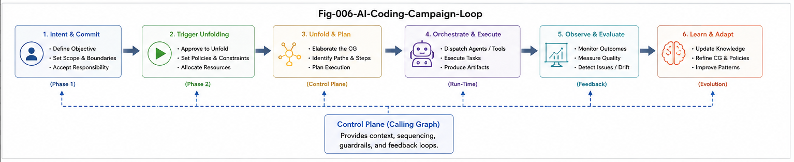

# CGU-006 — CallingGraph as an AI Coding Control Plane

## From Structural Design and Dispatch to Validation, Certification, and Learning

**Project:** CallingGraph Unfolding for AI Coding
**Series:** CGU — CallingGraph Unfolding
**Document:** CGU-006
**Status:** Integrative Architecture Paper
**Scope:** Function-Only CallingGraph
**Version:** v1.0

---

## Abstract

The previous papers in the CGU series developed CallingGraph Unfolding from several directions.

CGU-001 introduced the CallingGraph as a folded functional structure capable of localized unfolding.

CGU-002 connected this mechanism to the broader lineage from Full-Universe Search to Two-Phase Search and Trigger-Localized Unfolding.

CGU-003 introduced the **Design-Time CallingGraph (DT-CG)** as a pre-coding structural planning object.

CGU-004 defined the **Unfolding Gap**:

$$
\Delta_U
$$

and showed that static CallingGraph similarity does not guarantee Unfolding or runtime equivalence.

CGU-005 developed Differential Unfolding and Evidence-Bounded Certification Confidence.

This paper integrates those ideas into a unified architecture.

The central claim is:

> **A CallingGraph can evolve from a post-hoc program representation into a structural control plane for AI coding.**

The complete lifecycle is:

$$
\boxed{
Design
\rightarrow
Unfold
\rightarrow
Simulate
\rightarrow
Dispatch
\rightarrow
Code
\rightarrow
Fold
\rightarrow
Compare
\rightarrow
Certify
\rightarrow
Learn
}
$$

Within this lifecycle, the CallingGraph plays different roles at different stages:

* **Pre-Coding:** design, planning, structural wargaming, segmentation;
* **In-Coding:** localization, task dispatch, coordination, boundary control;
* **Post-Coding:** folding, differential validation, certification, repair;
* **Across Campaigns:** structural learning and Design-Time CG evolution.

The result is not merely a graph-analysis framework.

It is a proposal for a broader **Structural AI Coding Lifecycle** in which structure organizes generation rather than being discovered only after generation.

This paper remains strictly within the Function-only CallingGraph model and treats richer Condition, State, and Policy dimensions as future work.

---



---

# 1. Introduction

AI coding is often described as a generation problem.

A typical pipeline is:

$$
Prompt
\rightarrow
Model
\rightarrow
Code
$$

More advanced systems may introduce multiple agents:

$$
Task
\rightarrow
Agents
\rightarrow
Code
$$

These approaches increase generation capability.

But they leave one central architectural question insufficiently addressed:

> **What structure organizes the generation process itself?**

If many agents participate, who decides:

* what should be built;
* how the task should be decomposed;
* which functional paths matter;
* which agents should receive which local tasks;
* which structures are required;
* which structures are forbidden;
* how returned code should be integrated;
* how deviations should be repaired;
* how the final implementation should be certified?

A CallingGraph can provide a structural answer.

---

# 2. The Conventional CallingGraph Role

The conventional CallingGraph lifecycle is:

$$
Program
\rightarrow
CallingGraph
\rightarrow
Analysis
$$

The program comes first.

The graph comes later.

Its roles include:

* visualization;
* debugging;
* dependency analysis;
* impact analysis;
* test planning;
* architecture inspection.

This is valuable.

But structurally, the graph remains downstream of coding.

CGU proposes moving it upstream.

---

# 3. The Control-Plane Transition

The new lifecycle is:

$$
Intent
\rightarrow
Design\text{-}Time\ CallingGraph
\rightarrow
AI\ Coding
\rightarrow
Program
\rightarrow
Realized\ CallingGraph
$$

Thus the CallingGraph exists:

* before coding;
* during coding;
* after coding.

This changes its architectural status.

We propose the transition:

$$
\boxed{
CallingGraph:
Post\text{-}Hoc\ Artifact
\rightarrow
AI\ Coding\ Control\ Plane
}
$$

---

# 4. What Is an AI Coding Control Plane?

A control plane does not need to implement every coding operation directly.

Instead, it determines:

* structure;
* boundaries;
* decomposition;
* routing;
* coordination;
* policy-relevant decisions;
* expected outcomes;
* validation references.

In the Function-only CGU model:

$$
\boxed{
CG\ Control\ Plane = Functional\ Structural\ Coordination\ Layer
}
$$

It organizes the execution plane.

---

# 5. Control Plane vs Execution Plane

We distinguish:

## Control Plane

Responsible for:

$$
Design
$$

$$
Localization
$$

$$
Segmentation
$$

$$
Dispatch
$$

$$
Comparison
$$

$$
Certification
$$

## Execution Plane

Responsible for:

$$
Reasoning
$$

$$
Code\ Generation
$$

$$
Local\ Testing
$$

$$
Implementation
$$

Thus:

```text id="4k4pva"
             STRUCTURAL CONTROL PLANE
                     DT-CG
                       |
          +------------+------------+
          |            |            |
          v            v            v
       AI Unit      AI Unit      AI Unit
          |            |            |
          v            v            v
        Code         Code         Code
          \            |            /
           +-----------+-----------+
                       |
                  EXECUTION RESULT
```

---

# 6. Why a Control Plane Is Needed

As AI coding scales, the problem changes.

The question is no longer only:

> Can an AI generate code?

It becomes:

> Can a large coding process remain structurally organized?

A multi-agent system without strong structural coordination may suffer from:

* duplicated work;
* incompatible assumptions;
* interface drift;
* missing paths;
* hidden dependencies;
* over-generation;
* weak accountability.

The control-plane role addresses these coordination problems.

---

# 7. The Canonical CGU Lifecycle

The complete CGU lifecycle is:

$$
\boxed{
Intent
\rightarrow
DT\text{-}CG
\rightarrow
Unfold
\rightarrow
Simulate
\rightarrow
Segment
\rightarrow
Dispatch
\rightarrow
Code
\rightarrow
Fold
\rightarrow
Compare
\rightarrow
Certify
\rightarrow
Learn
}
$$

Each stage has a distinct structural role.

---

# 8. Stage 1 — Intent

The process begins with:

$$
Intent
$$

or:

$$
Requirement
$$

This describes what the system should accomplish.

Natural-language requirements alone are often too ambiguous to serve as a machine-operable execution plan.

Therefore the next step is structuralization.

---

# 9. Stage 2 — Structural Design

Requirements are transformed into:

$$
DT\text{-}CG
$$

The DT-CG answers:

> What functional units should exist?

> What should call what?

> What paths should be available?

This creates:

$$
Intent
\rightarrow
Functional\ Topology
$$

before implementation.

---

# 10. Stage 3 — Unfolding

A static DT-CG is not enough.

It must be activated locally.

For trigger:

$$
t
$$

the system computes:

$$
U(DT\text{-}CG,t)
$$

This exposes the relevant structural hotspot.

Thus:

$$
\boxed{
Trigger
\rightarrow
Localization
\rightarrow
Unfolding
}
$$

remains the core computational mechanism.

---

# 11. Stage 4 — Structural Simulation

The unfolded design can be inspected before coding.

This is:

$$
Structural\ Wargaming
$$

or:

$$
Pre\text{-}Coding\ Structural\ Simulation
$$

Questions include:

* Is a path missing?
* Is a branch unnecessary?
* Is one function overloaded?
* Is a dependency awkward?
* Is the plan decomposable?
* Should an alternative design be considered?

This allows structural correction before source code is generated.

---

# 12. Stage 5 — Structural Segmentation

Once a design is acceptable:

$$
DT\text{-}CG
$$

is partitioned into:

$$
G_1,G_2,\dots,G_n
$$

These subgraphs become coding units.

The goal is:

$$
Large\ Coding\ Task
\rightarrow
Bounded\ Functional\ Tasks
$$

---

# 13. Stage 6 — Agent Dispatch

Each structural unit is assigned to an appropriate execution unit.

Formally:

$$
Dispatch:
G_i
\rightarrow
Agent_j
$$

The key principle is:

$$
\boxed{
Structure
\rightarrow
Organization
\rightarrow
Agents
}
$$

not:

$$
Agents
\rightarrow
Organization
$$

This keeps the software structure primary.

---

# 14. Stage 7 — Localized Coding

An agent receives:

$$
Task_i
$$

$$
G_i
$$

and relevant localized context.

Thus:

$$
G_i
\rightarrow
Context_i
\rightarrow
Agent_i
\rightarrow
Code_i
$$

This is:

$$
\boxed{
Localized\ AI\ Coding
}
$$

The agent works inside a structural boundary rather than across the entire repository.

---

# 15. Stage 8 — Folding the Result

After code generation:

$$
Code_i
\xrightarrow{Folding}
RT\text{-}CG_i
$$

This converts implementation back into a comparable structural representation.

At the global level:

$$
Program
\xrightarrow{Folding}
RT\text{-}CG
$$

Thus the lifecycle closes structurally.

---

# 16. Stage 9 — Structural Comparison

The realized graph is compared with the intended graph:

$$
DT\text{-}CG
\leftrightarrow
RT\text{-}CG
$$

producing:

$$
\Delta CG
$$

This identifies static structural deviations.

---

# 17. Stage 10 — Differential Unfolding

Static comparison is followed by:

$$
U(DT\text{-}CG,T)
\leftrightarrow
U(RT\text{-}CG,T)
$$

producing:

$$
\Delta_U(T)
$$

This detects differences that static graph matching may hide.

---

# 18. Stage 11 — Runtime Validation

Structural evidence can then be supplemented with runtime evidence.

This may include:

* tests;
* traces;
* execution scenarios;
* critical-path runs;
* integration results.

Thus:

$$
StructuralEvidence
+
RuntimeEvidence
\rightarrow
StrongerAssurance
$$

---

# 19. Stage 12 — Certification

Certification integrates:

$$
\Delta CG
$$

$$
\Delta_U
$$

$$
Coverage
$$

$$
RuntimeEvidence
$$

$$
Criticality
$$

into:

$$
CertificationConfidence
$$

The certificate becomes an evidence package rather than a simple Boolean label.

---

# 20. Stage 13 — Repair or Acceptance

Certification can produce several control actions:

```text id="n3g2ha"
Accept
Repair
Escalate
Replan
Reject
```

Thus certification is not the end of the process.

It is a decision point.

---

# 21. Stage 14 — Structural Learning

After the campaign:

$$
Results
\rightarrow
GapHistory
\rightarrow
DesignLearning
$$

Recurring deviations can improve future DT-CGs.

Thus:

$$
\boxed{
Certification
\rightarrow
Learning
}
$$

closes the longer-term loop.

---

# 22. The Full Control Loop

The complete control loop is:

```text id="1m0b0n"
INTENT
  |
  v
DESIGN-TIME CG
  |
  v
UNFOLD
  |
  v
SIMULATE
  |
  v
SEGMENT
  |
  v
DISPATCH
  |
  v
CODE
  |
  v
FOLD
  |
  v
COMPARE
  |
  v
CERTIFY
  |
  +--> ACCEPT
  |
  +--> REPAIR
  |
  +--> ESCALATE
  |
  +--> REPLAN
  |
  v
LEARN
  |
  +-----------> BETTER DT-CG
```

---

# 23. The CallingGraph Is the Structural Backbone

Notice that the CallingGraph appears repeatedly:

$$
DT\text{-}CG
$$

before coding,

$$
CG_i
$$

during local task dispatch,

and:

$$
RT\text{-}CG
$$

after coding.

This persistence is important.

The same structural language connects:

$$
Planning
$$

to:

$$
Execution
$$

to:

$$
Validation
$$

This makes the CallingGraph a structural backbone across the lifecycle.

---

# 24. One Structural Language Across the Lifecycle

Traditional workflows often use different representations at different stages:

```text id="jjg54e"
Requirements -> prose
Architecture -> diagrams
Coding -> source
Testing -> test cases
Certification -> scores
```

These representations may not connect cleanly.

CGU proposes a shared structural spine:

$$
CallingGraph
$$

across many stages.

This creates:

$$
\boxed{
Structural\ Continuity
}
$$

from design to certification.

---

# 25. Structural Continuity

The chain becomes:

$$
Intent
\rightarrow
DT\text{-}CG
\rightarrow
LocalCG
\rightarrow
Code
\rightarrow
RT\text{-}CG
\rightarrow
\Delta CG
\rightarrow
\Delta_U
$$

This preserves traceability.

A later reviewer can ask:

> Which design node produced this code?

> Which coding unit implemented this path?

> Which realized path deviated from design?

> Which certification evidence covers this region?

This is structural provenance.

---

# 26. Structural Provenance Chain

We define:

$$
\boxed{
Structural\ Provenance\ Chain
}
$$

as:

$$
Intent
\rightarrow
DT\text{-}CG
\rightarrow
Unfolding
\rightarrow
Task
\rightarrow
Agent
\rightarrow
Code
\rightarrow
RT\text{-}CG
\rightarrow
Evidence
$$

This chain makes AI coding more auditable.

---

# 27. From Token-Centered Coding to Structure-Centered Coding

A major conceptual transition is:

$$
TokenGeneration
$$

is no longer the center of the whole process.

Instead:

$$
StructuralPlanning
$$

becomes upstream control.

The agent still generates tokens.

But the control plane decides:

* where generation should occur;
* what structural role it serves;
* what boundaries it must respect;
* what result is expected.

Thus:

$$
\boxed{
Move\ the\ AI\ Coding\ Control\ Center
from\ Token\ Generation
to\ Structural\ Planning
}
$$

---

# 28. Generation Becomes a Local Operation

In a structure-centered system:

$$
Global\ Objective
$$

does not immediately produce:

$$
Global\ Code
$$

Instead:

$$
GlobalObjective
\rightarrow
GlobalStructure
\rightarrow
LocalStructures
\rightarrow
LocalGeneration
$$

Thus large-scale software becomes a composition of bounded structural tasks.

---

# 29. The Dispatch Tree

The CallingGraph control plane can behave like a dispatch tree.

For example:

```text id="ybu040"
                    Project
                       |
          +------------+------------+
          |            |            |
          v            v            v
       Security     Business      Storage
          |            |            |
          v            v            v
       Agent S      Agent B      Agent D
```

The dispatch structure derives from functional topology.

This can scale recursively.

---

# 30. Recursive Dispatch

A subgraph may itself be large.

Therefore:

$$
G_i
$$

can be unfolded and segmented again:

$$
G_i
\rightarrow
G_{i1},G_{i2},\dots
$$

Then:

$$
Agent_i
$$

may act as a local coordinator or specialized unit.

This suggests hierarchical AI coding organization.

---

# 31. Hierarchical Control

A large coding system may use:

$$
Global\ DT\text{-}CG
$$

$$
Subsystem\ DT\text{-}CG
$$

$$
Task\ DT\text{-}CG
$$

forming:

$$
Global
\rightarrow
Subsystem
\rightarrow
Task
$$

This is structurally analogous to hierarchical planning in complex organizations.

---

# 32. Local Autonomy Within Structural Bounds

The control plane should not eliminate agent autonomy.

Instead:

$$
AgentAutonomy
$$

operates within:

$$
StructuralBoundary
$$

This gives:

$$
\boxed{
Bounded\ Autonomy
}
$$

An agent may choose algorithms, implementation details, naming, or local refactoring as long as structural constraints are respected.

---

# 33. Bounded Autonomy

Suppose the DT-CG specifies:

$$
A\rightarrow B\rightarrow C
$$

The agent may implement:

* different internal algorithms;
* helper functions;
* different data structures;

while preserving required functional structure.

Thus:

$$
Structure
$$

acts as the stable contract,

while:

$$
Implementation
$$

remains flexible.

---

# 34. Structural Contracts

Edges crossing subgraph boundaries can become explicit contracts.

For example:

$$
G_A
\rightarrow
G_B
$$

defines a required inter-unit relation.

A control plane can verify:

$$
BoundaryExpected
$$

against:

$$
BoundaryRealized
$$

This reduces integration ambiguity.

---

# 35. Coordination Through Structure

Multi-agent coordination often relies heavily on message exchange.

CGU offers another coordination mechanism:

$$
SharedStructuralReference
$$

Agents can coordinate partly by referring to:

$$
DT\text{-}CG
$$

rather than negotiating every relation from scratch.

This may reduce coordination overhead.

---

# 36. Structural Blackboard

A DT-CG may function as a kind of structural blackboard.

Each agent can inspect:

* assigned region;
* upstream dependencies;
* downstream dependencies;
* completed regions;
* unresolved gaps.

Thus the graph becomes a shared coordination surface.

---

# 37. Progress Tracking

The DT-CG can also track implementation progress.

Nodes may be classified operationally as:

```text id="s4o6nl"
Planned
Assigned
In Progress
Implemented
Validated
Certified
Blocked
```

These statuses are not new structural dimensions in the formal CGU model.

They are workflow metadata attached to the Function-only structural plan.

---

# 38. Gap-Aware Execution

If implementation reveals a gap:

$$
\Delta
$$

the control plane can localize it:

$$
Gap
\rightarrow
CG_{local}
$$

then dispatch a repair task.

Thus:

$$
\boxed{
Gap
\rightarrow
Localization
\rightarrow
Repair
}
$$

becomes a native operation.

---

# 39. Repair as Local Re-Unfolding

Suppose a missing path is detected:

$$
B\rightarrow C\rightarrow D
$$

expected,

but:

$$
B\rightarrow D
$$

realized.

The system can unfold around:

$$
B
$$

and:

$$
D
$$

to generate a bounded repair task.

This is more precise than regenerating a large module.

---

# 40. Replanning vs Repair

Not every mismatch should be repaired toward the original DT-CG.

Sometimes the implementation reveals that the original design was incomplete.

Then:

$$
RT\text{-}CG
$$

may contain a justified improvement.

The correct action may be:

$$
Update(DT\text{-}CG)
$$

rather than:

$$
Force(RT\text{-}CG\rightarrow DT\text{-}CG)
$$

This distinction is crucial.

---

# 41. Design Is Revisable

The DT-CG is an authoritative reference, but not an infallible one.

Therefore:

$$
Design
$$

must remain revisable under new evidence.

A mature control plane supports:

$$
ImplementationEvidence
\rightarrow
DesignReview
\rightarrow
DesignUpdate
$$

This prevents certification from becoming rigid conformance enforcement.

---

# 42. Structural A/B Planning

Multiple candidate designs may exist:

$$
DT\text{-}CG_A
$$

$$
DT\text{-}CG_B
$$

The control plane can unfold both:

$$
U_A(T)
$$

$$
U_B(T)
$$

and compare:

* complexity;
* path length;
* modularity;
* dependency count;
* expected implementation cost.

This supports structural A/B design.

---

# 43. Structural Wargaming Before Coding

This process can be summarized as:

$$
Plan_A
\leftrightarrow
Plan_B
$$

under:

$$
Unfolding
$$

before:

$$
CodeGeneration
$$

Thus software design becomes more experimentally inspectable.

---

# 44. Primary and Fallback Plans

A control plane can also preserve:

$$
PrimaryPlan
$$

and:

$$
FallbackPlan
$$

For example:

```text id="lr3187"
Primary:
A -> B -> C -> D

Fallback:
A -> B -> X -> D
```

If \(C\) proves infeasible, the system can replan structurally.

---

# 45. Structural Plan Switching

This gives:

$$
PlanFailure
\rightarrow
AlternativeCG
\rightarrow
LocalizedRedispatch
$$

rather than:

$$
PlanFailure
\rightarrow
RestartEverything
$$

This can make AI coding more resilient.

---

# 46. The Control Plane as a Routing System

The CallingGraph control plane performs several routing functions:

$$
Task
\rightarrow
StructuralRegion
$$

$$
StructuralRegion
\rightarrow
Agent
$$

$$
Gap
\rightarrow
RepairUnit
$$

$$
Uncertainty
\rightarrow
Escalation
$$

Thus routing becomes structural rather than purely conversational.

---

# 47. Escalation Routes

A local agent may encounter:

$$
Unknown
$$

$$
Conflict
$$

$$
HighRiskGap
$$

The control plane may route the issue to:

* specialist AI;
* stronger reasoning model;
* human reviewer;
* architecture replanning.

This gives escalation explicit structural location.

---

# 48. Human-in-the-Loop by Hotspot

Human oversight can be localized.

Instead of reviewing all code:

$$
Human
\rightarrow
CriticalHotspots
$$

Examples:

* high-impact nodes;
* major graph changes;
* critical gaps;
* fallback-plan switches;
* low-confidence certification regions.

This makes human review more scalable.

---

# 49. Structural Show-Stops

Some control-plane rules may define:

$$
ShowStop=True
$$

for critical structural violations.

Then:

$$
Generation
\rightarrow
Pause/Reject/Escalate
$$

This creates hard structural boundaries.

---

# 50. Certification as Control

CGU-005 established certification as evidence-based assurance.

CGU-006 adds another interpretation:

$$
\boxed{
Certification = Control\ Signal
}
$$

A certification result can determine whether the system should:

* merge;
* repair;
* re-run;
* escalate;
* replan;
* deploy.

Thus certification is operational, not merely descriptive.

---

# 51. Continuous Structural Assurance

The control plane can validate continuously.

Instead of:

$$
CodeEverything
\rightarrow
FinalCheck
$$

use:

$$
Generate
\rightarrow
Fold
\rightarrow
Compare
\rightarrow
Continue
$$

at multiple stages.

This creates:

$$
\boxed{
Continuous\ Structural\ Assurance
}
$$

---

# 52. Local Certification

Each subgraph:

$$
G_i
$$

may receive local evidence:

$$
Cert(G_i)
$$

before integration.

This reduces the accumulation of structural drift.

---

# 53. Global Certification

After integration:

$$
G_1+\cdots+G_n
\rightarrow
RT\text{-}CG_{global}
$$

the system performs global comparison.

This is necessary because cross-boundary problems may not appear locally.

---

# 54. Cross-Boundary Validation

Suppose local modules are all individually correct.

The integrated system may still contain:

* missing calls;
* duplicate calls;
* bypass paths;
* incorrect dependency directions.

Therefore:

$$
LocalCorrectness
\not\Rightarrow
GlobalStructuralCorrectness
$$

This is why the control plane must preserve global topology.

---

# 55. The After-Action Review

After a coding campaign, the system can examine:

$$
ExpectedStructure
$$

vs:

$$
RealizedStructure
$$

vs:

$$
ObservedRuntime
$$

This is analogous to an after-action review.

The goal is learning.

---

# 56. Structural After-Action Record

A record may include:

```text id="y8mlhp"
Original DT-CG
Alternative DT-CGs
Selected Plan
Agent Assignments
Generated Code
RT-CG
Delta-CG
Delta-U
Repairs
Approved Deviations
Runtime Evidence
Certificate
Lessons Learned
```

This creates persistent structural experience.

---

# 57. Structural Learning Signal

A recurring mismatch can become:

$$
CandidateDifference
$$

For example:

$$
DT:
A\rightarrow B\rightarrow C
$$

repeatedly becomes:

$$
RT:
A\rightarrow B\rightarrow X\rightarrow C
$$

Then:

$$
X
$$

may represent missing design knowledge.

---

# 58. Candidate Promotion

The learning process may follow:

$$
RecurringGap
\rightarrow
CandidateStructure
\rightarrow
A/B
\rightarrow
Validation
\rightarrow
Promotion
$$

If successful:

$$
DT\text{-}CG'
$$

is updated.

Thus future design improves.

---

# 59. CallingGraph and Structural Continual Learning

This produces a structural continual-learning loop:

$$
Experience
\rightarrow
Difference
\rightarrow
Candidate
\rightarrow
Validation
\rightarrow
StructuralGrowth
$$

The control plane therefore can evolve over time rather than remaining static.

---

# 60. From Campaign Execution to Dispatch-Tree Growth

If certain task classes repeatedly require new structural branches, the dispatch architecture can grow.

For example:

```text id="ej889y"
Task
 |
 +--> Known Path
 |
 +--> New Candidate Path
         |
         v
       A/B Test
         |
         v
       Promote
```

This connects AI coding control with structural growth.

---

# 61. Control Plane Memory

The DT-CG library can preserve prior structural knowledge.

A new project may reuse:

* known subgraphs;
* common patterns;
* validated calling paths;
* certified architectural motifs.

Thus:

$$
PastCampaigns
\rightarrow
StructuralMemory
\rightarrow
FutureDesign
$$

---

# 62. Structural Templates vs Rigid Templates

Reuse should not mean copying identical programs.

Instead, a reusable CG can act as:

$$
StructuralTemplate
$$

that supports:

$$
LocalizedUnfolding
$$

into new implementations.

This preserves flexibility.

---

# 63. Generative Skeleton Revisited

The CallingGraph is therefore:

$$
\boxed{
Generative\ Structural\ Skeleton
}
$$

It constrains and guides generation without uniquely determining implementation.

This is one of the central implications of CGU.

---

# 64. The Double Direction of CallingGraph

CallingGraph now supports two complementary directions.

### Folding Direction

$$
Program
\rightarrow
CG
$$

### Unfolding Direction

$$
CG
\rightarrow
LocalizedFunctionalPossibility
$$

Together:

$$
\boxed{
Program
\leftrightarrow
CallingGraph\ Structural\ Space
}
$$

not as a perfect inverse relation, but as an operational two-way structural interface.

---

# 65. Folding and Unfolding as a Control Loop

This enables:

$$
PlanCG
\rightarrow
Unfold
\rightarrow
Code
\rightarrow
Fold
\rightarrow
Compare
$$

The output of one direction becomes evidence for the other.

This is the basic feedback mechanism of the control plane.

---

# 66. Why Unfolding Is Central

Without Unfolding:

$$
CG
$$

remains mainly a static topology.

With Unfolding:

$$
CG
$$

becomes actionable.

It can produce:

* local coding regions;
* candidate paths;
* task boundaries;
* simulation results;
* validation surfaces.

Thus:

$$
\boxed{
Unfolding
\text{ turns structure into action.}
}
$$

---

# 67. Why Folding Is Also Central

Without Folding, the system cannot easily compare generated code back to intended structure.

Folding creates:

$$
RT\text{-}CG
$$

which closes the loop.

Thus:

$$
\boxed{
Folding
\text{ turns action back into structure.}
}
$$

Together:

$$
Unfold
\rightarrow
Act
\rightarrow
Fold
$$

forms a structural control cycle.

---

# 68. The Core CGU Cycle

The smallest complete control cycle is:

$$
\boxed{
CG
\rightarrow
Unfold
\rightarrow
Code
\rightarrow
Fold
\rightarrow
CG'
}
$$

Then compare:

$$
CG
\leftrightarrow
CG'
$$

This cycle can repeat until acceptable convergence.

---

# 69. Structural Convergence

A future implementation may define:

$$
Distance(DT,RT)
$$

and iterate:

$$
RT_1
\rightarrow
Repair
\rightarrow
RT_2
\rightarrow
Repair
\rightarrow
RT_3
$$

until:

$$
Distance(DT,RT_k)
\leq
\epsilon
$$

subject to certification policy.

This is structural convergence.

---

# 70. But Exact Convergence Is Not Always Required

A realized structure need not become identical to design.

Approved deviations may remain.

Thus the goal is not necessarily:

$$
DT=RT
$$

but:

$$
RT
\in
AcceptableStructuralRegion(DT)
$$

This is a more flexible formulation.

---

# 71. Acceptable Structural Region

A future control plane may define:

$$
\mathcal{A}(DT)
$$

as the set of acceptable realizations of a design.

Then:

$$
RT
\in
\mathcal{A}(DT)
$$

may be sufficient for acceptance.

This reflects the generative nature of coding.

---

# 72. AI Coding Governance

Once the CallingGraph determines:

* what structures are allowed;
* where agents operate;
* which deviations are acceptable;
* when escalation occurs;
* what evidence is required;

it participates in governance.

Thus:

$$
\boxed{
CGU
\rightarrow
Structural\ AI\ Coding\ Governance
}
$$

---

# 73. Governance Without Token Micromanagement

The control plane does not need to control every generated token.

Instead it governs higher-level functional structure.

This creates a useful separation:

$$
TokenFreedom
$$

within:

$$
StructuralGovernance
$$

This may be more scalable than token-level micromanagement.

---

# 74. Structural Assurance Before Semantic Perfection

The Function-only model does not claim to solve all software correctness.

But it can still provide a strong structural layer.

Thus:

$$
FunctionalStructuralAssurance
$$

can exist even before richer semantic dimensions are added.

This makes Function-only CGU a practical first step.

---

# 75. Function-Only Control Plane

The v1.0 control plane operates on:

$$
F=Function
$$

It knows:

* planned functional units;
* calling relations;
* paths;
* subgraphs;
* local structural regions.

It does not yet formally model:

* condition;
* state;
* policy;
* time;
* probability.

This boundary must remain explicit.

---

# 76. Why Function-Only Is Enough for a First Control Plane

Even Function-only structure can support:

* decomposition;
* localization;
* agent dispatch;
* dependency management;
* path validation;
* gap detection;
* structural certification.

Therefore richer dimensions are not required to establish the control-plane principle.

They can be added later if they create clear operational value.

---

# 77. Future Core Dimensions

Future research may extend:

$$
F
$$

to:

$$
F+C
$$

then:

$$
F+C+S
$$

with:

$$
P
$$

as a possible projection or policy operator.

A richer future structure may support:

$$
Projection
\rightarrow
LocalizedCG
\rightarrow
Unfolding
$$

But this is outside CGU v1.0.

---

# 78. From Graph to Calling Structural Space

A deeper future possibility is that the visible CallingGraph is only one projection of a richer structure.

Then:

$$
CallingStructuralSpace
\xrightarrow{Projection}
CallingGraph
\xrightarrow{Unfolding}
Trajectory
$$

This remains an open research direction.

CGU v1.0 deliberately establishes the simpler Function-only foundation first.

---

# 79. The Seven Operational Roles of CGU

Within the AI coding lifecycle, CallingGraph Unfolding supports seven major roles:

1. **Structural Design**
2. **Structural Simulation**
3. **Localization**
4. **Dispatch**
5. **Generation Control**
6. **Validation and Certification**
7. **Structural Learning**

These roles form the control-plane architecture.

---

# 80. Role I — Structural Design

The DT-CG records intended functional topology before code exists.

---

# 81. Role II — Structural Simulation

Unfolding enables pre-coding inspection of possible functional paths and missing structures.

---

# 82. Role III — Localization

Triggers identify structural hotspots and bound active work regions.

---

# 83. Role IV — Dispatch

Subgraphs become task units and route work to specialized agents.

---

# 84. Role V — Generation Control

Agents generate code inside structurally defined scopes and contracts.

---

# 85. Role VI — Validation and Certification

Folding and Differential Unfolding compare intended and realized structures.

---

# 86. Role VII — Structural Learning

Recurring gaps and approved deviations improve future DT-CGs.

---

# 87. The Campaign Model

The entire system can also be expressed as a campaign:

```text id="dqz0cd"
1. Intelligence
   Requirement understanding

2. Wargaming
   DT-CG Unfolding

3. Campaign Planning
   Select primary / alternative structure

4. Deployment
   Segment graph and assign agents

5. Execution
   Localized AI coding

6. After-Action Review
   Fold, compare, validate, certify

7. Structural Learning
   Improve future DT-CG
```

This is not merely an analogy.

It captures the functional stages of coordinated large-scale AI coding.

---

# 88. AI/ASI Coding at Larger Scale

As coding systems become more autonomous, planning and coordination may become more important than raw generation alone.

A powerful model can generate code.

But a larger AI/ASI coding system must also decide:

$$
What
$$

$$
Where
$$

$$
In\ What\ Order
$$

$$
By\ Which\ Unit
$$

$$
Under\ What\ Structural\ Constraints
$$

CGU addresses this organizational layer.

---

# 89. CallingGraph as an Organizational Primitive

The CallingGraph can therefore become more than a software-analysis graph.

It may function as:

$$
\boxed{
Organizational\ Primitive
}
$$

for AI coding.

Functions become work units.

Paths become dependencies.

Subgraphs become teams or missions.

Boundaries become contracts.

Gaps become repair tasks.

---

# 90. The Structural Coding Campaign

A complete coding campaign may therefore look like:

$$
Objective
$$

$$
\downarrow
$$

$$
DT\text{-}CG
$$

$$
\downarrow
$$

$$
StructuralWargaming
$$

$$
\downarrow
$$

$$
TaskUnits
$$

$$
\downarrow
$$

$$
Agents
$$

$$
\downarrow
$$

$$
Code
$$

$$
\downarrow
$$

$$
RT\text{-}CG
$$

$$
\downarrow
$$

$$
Certification
$$

$$
\downarrow
$$

$$
Learning
$$

---

# 91. The Control Handle

A key property of the CallingGraph is inspectability.

Compared with deeply latent model representations, a CallingGraph can provide a visible control handle.

Humans and machines can inspect:

* nodes;
* edges;
* paths;
* subgraphs;
* deltas.

This makes it suitable for governance.

---

# 92. Structural Explainability

When an AI coding decision is questioned, the control plane can explain structurally:

```text id="vrbgom"
This agent was assigned because:
- the task localized to subgraph G7;
- G7 contains database-related functions;
- the selected specialist matched that region;
- the generated RT-CG preserved required edges;
- one unexpected edge was reviewed and approved.
```

This is a concrete form of explainability.

---

# 93. Explainability Through Provenance

The strongest explanations come from the provenance chain:

$$
Intent
\rightarrow
Design
\rightarrow
Dispatch
\rightarrow
Implementation
\rightarrow
Validation
$$

Rather than explaining only a final output, the system explains the structural process that produced it.

---

# 94. From QA Layer to Lifecycle Infrastructure

One of the most important conclusions is:

$$
\boxed{
CallingGraph\ Unfolding
\neq
Post\text{-}Coding\ QA\ Only
}
$$

Instead:

$$
\boxed{
CallingGraph\ Unfolding
=
Pre\text{-}Coding\ Design
+
In\text{-}Coding\ Control
+
Post\text{-}Coding\ Assurance
}
$$

This is the core architectural upgrade.

---

# 95. Why Certification Comes Late but Influences Early Stages

Certification is near the end of the visible lifecycle.

But its evidence requirements should influence early planning.

For example, if a critical path must later be certified, the DT-CG can mark it early for:

* stronger segmentation;
* specialist assignment;
* extra tests;
* deeper unfolding.

Thus assurance requirements propagate upstream.

---

# 96. Assurance-Driven Planning

This creates:

$$
CertificationRequirement
\rightarrow
DesignRequirement
$$

not only:

$$
Code
\rightarrow
Certification
$$

The control plane can therefore design for certifiability.

---

# 97. Designing for Certifiability

A structurally cleaner DT-CG may be easier to certify.

For example:

* clear module boundaries;
* limited cross-calls;
* explicit critical paths;
* fewer hidden dependencies.

Thus:

$$
DesignQuality
$$

and:

$$
Certifiability
$$

may become related objectives.

---

# 98. Designing for AI Coding

Similarly, some structures may be easier for AI agents to implement.

A good DT-CG may produce:

* smaller local tasks;
* clearer interfaces;
* less cross-context reasoning;
* simpler integration.

Thus:

$$
Architecture
$$

can be optimized partly for AI coding execution.

---

# 99. Structural AI-Native Software Design

This suggests a future field:

$$
\boxed{
Structural\ AI\text{-}Native\ Software\ Design
}
$$

where architectures are designed not only for runtime quality and human maintainability, but also for:

* AI decomposability;
* localized generation;
* agent specialization;
* structural certifiability.

---

# 100. Research Questions

### RQ-1 — How should DT-CGs be generated from requirements?

This is the first major automation problem.

---

### RQ-2 — How should structural wargaming evaluate plans?

Metrics may include:

* path coverage;
* modularity;
* criticality;
* coupling;
* implementation cost.

---

### RQ-3 — How should segmentation be optimized?

The goal is to balance:

$$
LocalAutonomy
$$

with:

$$
IntegrationCost
$$

---

### RQ-4 — How should agents be selected?

Possible inputs include:

* subgraph type;
* expected complexity;
* domain;
* past performance;
* certification requirements.

---

### RQ-5 — How should local context be built from a subgraph?

CG-localized context construction is a major implementation question.

---

### RQ-6 — How should returned code be folded reliably?

Accurate RT-CG extraction is critical to the feedback loop.

---

### RQ-7 — How should structural deviations be classified?

Differences may be:

* defects;
* improvements;
* implementation details;
* unknowns.

---

### RQ-8 — How should local certificates compose?

Global integration requires explicit boundary evidence.

---

### RQ-9 — How should structural learning update future DT-CGs?

This requires promotion, decay, and versioning rules.

---

### RQ-10 — How much does CG-based control improve AI coding?

This requires controlled comparisons with less structured agentic workflows.

---

# 101. Canonical Architecture

```text id="3u3x7d"
                           INTENT
                              |
                              v
                         REQUIREMENT
                              |
                              v
                     DESIGN-TIME CG
                              |
                    +---------+---------+
                    |                   |
                    v                   v
                UNFOLDING          ALTERNATIVE CG
                    |
                    v
             STRUCTURAL WARGAMING
                    |
                    v
             STRUCTURAL SEGMENTATION
                    |
          +---------+---------+---------+
          |                   |         |
          v                   v         v
       AI UNIT             AI UNIT    AI UNIT
          |                   |         |
          v                   v         v
        CODE                CODE      CODE
          \                   |         /
           +------------------+--------+
                              |
                              v
                           PROGRAM
                              |
                           FOLDING
                              |
                              v
                         REALIZED CG
                              |
                   +----------+----------+
                   |                     |
                   v                     v
                DELTA-CG          DIFFERENTIAL
                                  UNFOLDING
                                      |
                                      v
                                   DELTA-U
                                      |
                                      v
                               RUNTIME EVIDENCE
                                      |
                                      v
                                 CERTIFICATION
                                      |
                 +--------------------+--------------------+
                 |                    |                    |
                 v                    v                    v
              ACCEPT               REPAIR              REPLAN
                                                           |
                                                           v
                                                        LEARN
                                                           |
                                                           v
                                                    BETTER DT-CG
```

---

# 102. Canonical Statements

### Canonical Statement I

> **CallingGraph Unfolding turns a CallingGraph from a passive representation into an actionable structural control object.**

### Canonical Statement II

> **A Design-Time CallingGraph can organize AI coding before source-code generation begins.**

### Canonical Statement III

> **In scalable AI coding, structure should determine organization and organization should determine agent dispatch.**

### Canonical Statement IV

> **Folding closes the loop by converting generated software back into a structure that can be compared with design intent.**

### Canonical Statement V

> **Differential Unfolding and runtime evidence transform CallingGraph comparison into evidence-bounded certification.**

### Canonical Statement VI

> **Certification should feed repair, replanning, and structural learning rather than act only as a final score.**

### Canonical Statement VII

> **The long-term role of CallingGraph may be a structural control plane spanning design, generation, validation, and learning.**

---

# 103. The Canonical CGU Equation

The complete CGU lifecycle can be summarized as:

$$
\boxed{
DT\text{-}CG
\xrightarrow{Unfold}
LocalStructure
\xrightarrow{Dispatch}
AI\ Coding
\xrightarrow{Fold}
RT\text{-}CG
\xrightarrow{Diff}
Evidence
\xrightarrow{Certify}
Decision
\xrightarrow{Learn}
DT\text{-}CG'
}
$$

This is the canonical control loop.

---

# 104. The Central Paradigm Shift

The deepest transition proposed by CGU is:

$$
\boxed{
Prompt\text{-}Centered\ Coding
\rightarrow
Structure\text{-}Centered\ Coding
}
$$

or more specifically:

$$
\boxed{
Token\ Generation
\text{ as the control center}
\rightarrow
Structural\ Campaign\ Planning
\text{ as the control center}
}
$$

Token generation remains necessary.

But it becomes an execution capability inside a larger structural system.

---

# 105. The CGU Grand Principle

The entire six-paper series can be compressed into one line:

$$
\boxed{
Design\ Structure.
Unfold\ Locally.
Dispatch\ Intelligently.
Generate\ Within\ Bounds.
Fold\ the\ Result.
Compare\ the\ Difference.
Certify\ the\ Evidence.
Learn\ the\ Structure.
}
$$

---

# 106. Conclusion

CallingGraphs have traditionally lived downstream of software implementation.

They describe what software already is.

CallingGraph Unfolding introduces another direction.

A CallingGraph can also participate upstream:

$$
Intent
\rightarrow
DT\text{-}CG
$$

and during execution:

$$
DT\text{-}CG
\rightarrow
Localized\ Task
\rightarrow
AI\ Agent
$$

and after execution:

$$
Code
\rightarrow
RT\text{-}CG
\rightarrow
Differential\ Validation
$$

This creates a complete structural lifecycle:

$$
\boxed{
Design
\rightarrow
Unfold
\rightarrow
Simulate
\rightarrow
Dispatch
\rightarrow
Code
\rightarrow
Fold
\rightarrow
Compare
\rightarrow
Certify
\rightarrow
Learn
}
$$

The CallingGraph thereby changes role.

It is no longer only:

$$
Post\text{-}Hoc\ Analysis\ Artifact
$$

It becomes a candidate:

$$
\boxed{
Structural\ Control\ Plane\ for\ AI/ASI\ Coding
}
$$

The control plane does not replace generative models.

It organizes them.

It does not eliminate implementation freedom.

It bounds that freedom structurally.

It does not guarantee complete behavioral correctness.

It provides inspectable structural evidence and a path toward stronger assurance.

It does not require all future CallingGraph dimensions immediately.

The Function-only model already supports a substantial architecture:

$$
Design
$$

$$
Localization
$$

$$
Dispatch
$$

$$
Validation
$$

$$
Certification
$$

$$
Learning
$$

The next research challenge is therefore implementation.

The theory should now be tested through concrete systems that construct Design-Time CallingGraphs, unfold local functional regions, dispatch coding tasks, fold generated results, detect Unfolding Gaps, and produce explainable certification evidence.

The long-term possibility is significant:

> **Future AI coding systems may not simply generate programs. They may design, unfold, execute, validate, and learn software through persistent structural control.**

That is the broader research direction opened by CallingGraph Unfolding.

---

## CGU Series Summary

### CGU-001 — CallingGraph Unfolding

$$
Program
\rightarrow
CallingGraph
\rightarrow
LocalizedFunctionalPossibility
$$

Introduced Folding, Unfolding, and Trigger-Localized expansion.

---

### CGU-002 — From Two-Phase Search to Trigger-Localized Unfolding

$$
FullUniverse
\rightarrow
CandidateSpace
\rightarrow
StructuralHotspot
\rightarrow
LocalizedUnfolding
$$

Established the search-to-structure lineage.

---

### CGU-003 — Design-Time CallingGraph

$$
Requirement
\rightarrow
DT\text{-}CG
\rightarrow
StructuralWargaming
\rightarrow
Dispatch
$$

Moved CallingGraph upstream into pre-coding planning.

---

### CGU-004 — The Unfolding Gap

$$
CGMatch
\neq
UnfoldingEquivalence
$$

Defined:

$$
\Delta_U
$$

and the Open-Unfolding Problem.

---

### CGU-005 — Differential Unfolding and Certification

$$
\Delta CG
+
\Delta_U
+
Coverage
+
RuntimeEvidence
\rightarrow
CertificationConfidence
$$

Established Evidence-Bounded Certification.

---

### CGU-006 — CallingGraph as an AI Coding Control Plane

$$
Design
\rightarrow
Unfold
\rightarrow
Dispatch
\rightarrow
Code
\rightarrow
Fold
\rightarrow
Certify
\rightarrow
Learn
$$

Integrates the complete Structural AI Coding Lifecycle.

---

## Scope Note

CGU v1.0 remains deliberately limited to:

$$
\boxed{
F=Function
}
$$

Future research may explore:

$$
F+C
$$

$$
F+C+S
$$

and:

$$
P=\text{Projection / Policy Operator}
$$

as well as richer Calling Structural Spaces.

These extensions should build on, rather than replace, the Function-only foundation established in this series.

---

**CGU-006 Principle**

$$
\boxed{
\text{Move AI Coding Control Upstream—from Token Generation to Structural Planning.}
}
$$

---

**CGU Grand Principle**

$$
\boxed{
\text{Design. Unfold. Dispatch. Generate. Fold. Compare. Certify. Learn.}
}
$$
